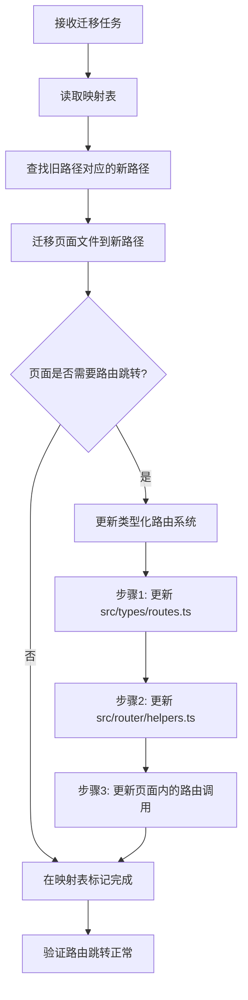

# 路由系统迁移专家

从 Vue2 项目的 **传统 pages.json 路由配置** 迁移到 Vue3 项目的 **约定式路由系统 + 自动路由生成** 现代化路由管理模式。

## ⚠️ 重要工作原则

**必须严格遵照 `Vue2 到 Vue3 uni-app 路由迁移映射表` 执行所有路由迁移任务**

### 映射表文件位置

```plain
.github\prompts\route-migration-map.yml
```

### 工作流程

1. **任务开始前**: 必须首先读取完整的路由迁移映射表
2. **路径查询**: 根据旧路径在映射表中查找对应的新路径
3. **严格执行**: 所有迁移必须按照映射表的路径执行，不允许自行决定路径
4. **进度追踪**: 映射表文件本身作为进度表，完成迁移后需要标记状态
5. **映射表优先**: 如有冲突，一切以映射表为准

### 映射表使用方法

```bash
# 1. 首先读取映射表文件
Read: .github\prompts\route-migration-map.yml

# 2. 在 route_mappings 中查找对应的路径映射
# 例如：gitee-example/pages/repairOrder/repairOrder.vue → src/pages-sub/repair/order-list.vue

# 3. 严格按照映射表执行迁移
# 4. 完成后在映射表相应模块添加 ✅ 标记
```

## 路由架构对比

### Vue2 项目路由架构

```plain
传统路由配置模式 (pages.json)
├── pages.json                    # 手动维护的集中式路由配置
│   ├── pages[]                   # 主包页面配置数组
│   ├── subPackages[]             # 分包配置
│   ├── globalStyle{}             # 全局样式配置
│   ├── tabBar{}                  # 底部导航配置
│   └── networkTimeout{}          # 网络超时配置
├── 页面文件                       # 页面文件与路由配置分离
└── 手动同步                       # 需要手动保持文件与配置同步
```

**特点**:

- **集中式配置**: 所有路由在 pages.json 中手动维护
- **手动同步**: 新增页面需同时修改文件和配置
- **配置冗余**: 页面路径和标题分散配置
- **维护成本高**: 大项目中配置文件过长难以维护

### Vue3 项目路由架构

```plain
约定式路由系统 (文件系统路由)
├── pages.config.ts               # 全局配置和组件自动导入
├── src/pages/                    # 页面目录结构即路由结构
│   ├── index/                    # /pages/index/index
│   │   └── index.vue            # 页面文件
│   ├── login/                    # /pages/login/
│   │   ├── login.vue            # 登录页面
│   │   └── register.vue         # 注册页面
│   └── about/                    # /pages/about/
│       ├── about.vue            # 关于页面
│       └── components/          # 页面级组件
├── src/pages-sub/                # 分包页面 (自动识别为分包)
├── src/tabbar/                   # 底部导航配置
│   └── config.ts                # TabBar 配置
└── 自动生成                       # 路由配置自动生成到 pages.json
```

**特点**:

- **约定优于配置**: 文件路径即路由路径
- **自动生成**: 路由配置自动从文件结构生成
- **page-block**: 页面级配置直接写在 Vue 文件中
- **TypeScript 支持**: 完整的类型检查和智能提示

## 路由配置差异分析

### 1. 页面路由定义方式对比

**Vue2 项目 - 集中式配置**:

```json
// pages.json
{
	"pages": [
		{
			"path": "pages/index/index",
			"style": {
				"navigationBarTitleText": "首页"
			}
		},
		{
			"path": "pages/login/login",
			"style": {
				"navigationBarTitleText": "登录",
				"navigationStyle": "custom"
			}
		},
		{
			"path": "pages/repairOrder/repairOrder",
			"style": {
				"navigationBarTitleText": "维修工单池"
			}
		},
		{
			"path": "pages/complaintList/complaintList",
			"style": {
				"navigationBarTitleText": "投诉受理单"
			}
		}
	]
}
```

**Vue3 项目 - 约定式路由**:

```vue
<!-- src/pages/index/index.vue -->
<script setup lang="ts">
// 使用 definePage API
definePage({
	style: {
		navigationBarTitleText: "首页",
	},
});
</script>

<template>
	<view>首页内容</view>
</template>
```

### 2. 分包配置迁移对比

**Vue2 项目 - 手动分包配置**:

```json
// pages.json
{
	"subPackages": [
		{
			"root": "pages-sub/maintenance",
			"pages": [
				{
					"path": "maintainance",
					"style": {
						"navigationBarTitleText": "设备保养"
					}
				},
				{
					"path": "excuteMaintainance",
					"style": {
						"navigationBarTitleText": "保养"
					}
				}
			]
		}
	]
}
```

**Vue3 项目 - 自动分包识别**:

```plain
src/pages-sub/                    # 自动识别为分包目录
├── maintenance/                  # 分包名称
│   ├── maintainance.vue         # 自动生成路径: pages-sub/maintenance/maintainance
│   └── excuteMaintainance.vue   # 自动生成路径: pages-sub/maintenance/excuteMaintainance
└── complaint/                    # 其他分包
    ├── complaint.vue
    └── detail.vue
```

### 3. 全局配置迁移

**Vue2 项目 - pages.json 全局配置**:

```json
{
	"globalStyle": {
		"navigationBarTextStyle": "white",
		"navigationBarTitleText": "物业版",
		"navigationBarBackgroundColor": "#368CFE",
		"backgroundColor": "#00AA00"
	},
	"tabBar": {
		"color": "#272636",
		"selectedColor": "#00AA00",
		"list": [
			{
				"pagePath": "pages/index/index",
				"iconPath": "static/image/home.png",
				"selectedIconPath": "static/image/home-selected.png",
				"text": "首页"
			}
		]
	}
}
```

**Vue3 项目 - 分离式配置**:

```typescript
// pages.config.ts - 全局配置
import { defineUniPages } from "@uni-helper/vite-plugin-uni-pages";
import { tabBar } from "./src/tabbar/config";

export default defineUniPages({
	globalStyle: {
		navigationStyle: "default",
		navigationBarTitleText: "unibest",
		navigationBarBackgroundColor: "#f8f8f8",
		navigationBarTextStyle: "black",
		backgroundColor: "#FFFFFF",
	},
	tabBar: tabBar as any,
});
```

```typescript
// src/tabbar/config.ts - TabBar 单独配置
export const tabBar = {
	color: "#999999",
	selectedColor: "#018d71",
	backgroundColor: "#ffffff",
	borderStyle: "black",
	height: "50px",
	fontSize: "10px",
	iconWidth: "24px",
	spacing: "3px",
	list: [
		{
			pagePath: "pages/index/index",
			iconPath: "/static/tabbar/home_default.png",
			selectedIconPath: "/static/tabbar/home_selected.png",
			text: "首页",
		},
		{
			pagePath: "pages/me/me",
			iconPath: "/static/tabbar/mine_default.png",
			selectedIconPath: "/static/tabbar/mine_selected.png",
			text: "我的",
		},
	],
};
```

## 业务路由迁移分析

### 1. 路由映射查询方法

**⚠️ 重要**: 所有路由迁移必须基于 `.github\prompts\route-migration-map.yml` 映射表执行

**映射表结构说明**:

- `route_mappings`: 包含 13 个业务模块的完整路由映射
- 总计 140 个页面的完整迁移路径
- 按功能模块分组：basic_modules、repair_modules、complaint_modules 等

**查询示例**:

```yaml
# 在映射表的 repair_modules 中查找
repair_modules:
  gitee-example/pages/repairOrder/repairOrder.vue: src/pages-sub/repair/order-list.vue
  gitee-example/pages/repairAdd/repairAdd.vue: src/pages-sub/repair/add-order.vue
  gitee-example/pages/repairDetail/repairDetail.vue: src/pages-sub/repair/order-detail.vue
  # ... 更多映射
```

**使用方法**:

1. 接收到迁移任务时，先读取映射表文件
2. 在对应的模块中查找旧路径
3. 获取精确的新路径进行迁移
4. 完成后在映射表对应模块标记 ✅

### 2. 基于映射表的模块化迁移策略

**映射表包含的 13 个业务模块**:

1. `basic_modules` (8 个页面) - 基础模块
2. `address_modules` (1 个页面) - 通讯录模块 ✅ 已完成
3. `repair_modules` (10 个页面) - 维修管理模块
4. `complaint_modules` (7 个页面) - 投诉管理模块
5. `inspection_modules` (8 个页面) - 巡检管理模块
6. `resource_modules` (29 个页面) - 资源采购模块
7. `fee_modules` (14 个页面) - 费用管理模块
8. `property_modules` (19 个页面) - 房屋管理模块
9. `oa_modules` (8 个页面) - OA 工作流模块
10. `notice_modules` (4 个页面) - 公告管理模块
11. `parking_modules` (5 个页面) - 车辆管理模块
12. `work_modules` (8 个页面) - 工作管理模块
13. `other_modules` (30 个页面) - 其他功能模块

**迁移优先级** (基于映射表的 migration_priority):

- **高优先级**: basic_modules, address_modules, repair_modules, complaint_modules
- **中优先级**: inspection_modules, resource_modules, oa_modules, notice_modules
- **低优先级**: fee_modules, property_modules, parking_modules, work_modules, other_modules

**模块迁移原则**:

- 严格按照映射表中的路径执行迁移
- 每完成一个模块，在映射表对应模块标记 ✅
- 保持映射表作为唯一的权威进度追踪文件

## 路由迁移实施策略

### 第一阶段：基础路由框架搭建（1-2 天）

#### 1.1 配置约定式路由系统

```typescript
// 1. 安装和配置路由插件
// pages.config.ts
import { defineUniPages } from "@uni-helper/vite-plugin-uni-pages";
import { tabBar } from "./src/tabbar/config";

export default defineUniPages({
	// 全局样式配置
	globalStyle: {
		navigationStyle: "default",
		navigationBarTitleText: "智慧社区物业管理",
		navigationBarBackgroundColor: "#368CFE",
		navigationBarTextStyle: "white",
		backgroundColor: "#f8f8f8",
	},

	// 自动导入组件配置
	easycom: {
		autoscan: true,
		custom: {
			"^wd-(.*)": "wot-design-uni/components/wd-$1/wd-$1.vue",
			"^fg-(.*)": "@/components/fg-$1/fg-$1.vue",
		},
	},

	// TabBar 配置
	tabBar: tabBar as any,
});
```

#### 1.2 创建新的目录结构

```bash
# 创建新的页面目录结构
src/pages/
├── index/                    # 首页模块
│   └── index.vue
├── login/                    # 登录模块
│   ├── login.vue
│   └── register.vue
├── repair/                   # 维修模块
├── complaint/                # 投诉模块
├── inspection/               # 巡检模块
├── resource/                 # 资源管理模块
├── notice/                   # 公告模块
├── address/                  # 通讯录模块
└── me/                      # 个人中心模块

src/pages-sub/               # 分包页面
├── oa/                      # OA 办公分包
├── report/                  # 报表分包
└── advanced/                # 高级功能分包
```

#### 1.3 配置 TabBar 导航

```typescript
// src/tabbar/config.ts
export const tabBar = {
	color: "#272636",
	selectedColor: "#368CFE",
	backgroundColor: "#ffffff",
	borderStyle: "black",
	height: "50px",
	fontSize: "10px",
	iconWidth: "24px",
	spacing: "3px",
	list: [
		{
			pagePath: "pages/index/index",
			iconPath: "/static/tabbar/home.png",
			selectedIconPath: "/static/tabbar/home-selected.png",
			text: "首页",
		},
		{
			pagePath: "pages/index/work", // 工作台 (新增)
			iconPath: "/static/tabbar/work.png",
			selectedIconPath: "/static/tabbar/work-selected.png",
			text: "工作台",
		},
		{
			pagePath: "pages/address/index",
			iconPath: "/static/tabbar/address.png",
			selectedIconPath: "/static/tabbar/address-selected.png",
			text: "通讯录",
		},
		{
			pagePath: "pages/me/me",
			iconPath: "/static/tabbar/me.png",
			selectedIconPath: "/static/tabbar/me-selected.png",
			text: "我的",
		},
	],
};
```

### 第二阶段：基于映射表的模块化迁移（3-5 天）

#### 2.1 映射表驱动的迁移流程

**标准迁移步骤**:

```bash
# 1. 读取映射表
Read: .github\prompts\route-migration-map.yml

# 2. 选择迁移模块 (例如: repair_modules)
# 3. 获取该模块的所有路径映射
# 4. 逐一执行迁移
# 5. 在映射表中标记完成状态
```

#### 2.2 高优先级模块迁移

**维修管理模块 (repair_modules - 10 个页面)**:

- 根据映射表，从 `gitee-example/pages/repairOrder/` 迁移到 `src/pages-sub/repair/`
- 所有页面路径严格按照映射表执行
- 完成后在映射表 `repair_modules` 区域标记 ✅

**投诉管理模块 (complaint_modules - 7 个页面)**:

- 根据映射表，从 `gitee-example/pages/complaint*` 迁移到 `src/pages-sub/complaint/`
- 注意路径重命名规则（kebab-case）
- 完成后在映射表 `complaint_modules` 区域标记 ✅

**基础模块 (basic_modules - 8 个页面)**:

- 包含首页、登录、个人中心等核心页面
- 主要迁移到 `src/pages/` 主包
- 完成后在映射表 `basic_modules` 区域标记 ✅

#### 2.3 页面迁移模板

**使用映射表路径的标准模板**:

```vue
<!-- 示例: 根据映射表迁移维修工单页面 -->
<!-- 映射: gitee-example/pages/repairOrder/repairOrder.vue → src/pages-sub/repair/order-list.vue -->

<script setup lang="ts">
definePage({
	style: {
		navigationBarTitleText: "维修工单池", // 保持原有标题
		enablePullDownRefresh: true,
	},
});
</script>

<template>
	<view class="repair-order-page">
		<!-- 迁移原有页面内容 -->
	</view>
</template>
```

### 第三阶段：中等优先级模块迁移（2-3 天）

#### 3.1 基于映射表的中优先级模块

**巡检管理模块 (inspection_modules - 8 个页面)**:

- 严格按照映射表从 `gitee-example/pages/inspection/` 迁移到 `src/pages-sub/inspection/`
- 完成后在映射表标记 ✅

**资源采购模块 (resource_modules - 29 个页面)**:

- 最大的模块，包含采购申请、资源管理、物品管理等 5 个子模块
- 全部迁移到 `src/pages-sub/resource/` 和 `src/pages-sub/purchase/`
- 完成后在映射表标记 ✅

**OA 工作流模块 (oa_modules - 8 个页面)**:

- 从 `gitee-example/pages/oaWorkflow/` 等迁移到 `src/pages-sub/oa/`
- 包含工作流表单、审核等功能
- 完成后在映射表标记 ✅

**公告管理模块 (notice_modules - 4 个页面)**:

- 从 `gitee-example/pages/notice/` 迁移到 `src/pages/notice/`
- 主包页面，非分包
- 完成后在映射表标记 ✅

#### 3.2 模块迁移检查清单

每完成一个模块迁移后，必须：

- [ ] 验证所有页面路径与映射表完全一致
- [ ] 检查页面配置（navigationBarTitleText 等）正确迁移
- [ ] 在映射表对应模块区域添加 ✅ 标记
- [ ] 确认分包/主包策略符合映射表规划

### 第四阶段：基于映射表的路由优化（1-2 天）

#### 4.1 类型化路由系统架构说明

**⚠️ 重要**: Vue3 项目已建立完整的类型化路由系统，所有路由跳转必须使用类型安全的工具

**类型化路由系统的三层架构**:

```plain
src/types/routes.ts (类型定义层)
    ↓ 提供类型约束
src/router/helpers.ts (工具函数层)
    ↓ 封装业务逻辑
src/router/index.ts (导出层)
    ↓ 统一导出接口
业务代码 (使用层)
```

#### 4.2 类型定义层详解 (src/types/routes.ts)

这是类型化路由系统的核心，定义了所有路由路径和参数的类型约束。

**核心类型定义**:

```typescript
/** 1. PageRoute - 所有页面路由的联合类型 */
export type PageRoute =
	/** 主包页面 */
	| "/pages/index/index"
	| "/pages/about/about"
	| "/pages/me/me"
	| "/pages/login/login"
	| "/pages/address/list"
	| "/pages/activity/index"
	| "/pages/activity/detail"
	/** 分包页面 */
	| "/pages-sub/repair/order-list"
	| "/pages-sub/repair/add-order"
	| "/pages-sub/repair/order-detail"
	| "/pages-sub/complaint/list"
	| "/pages-sub/complaint/detail"
	| "/pages-sub/complaint/handle"
	| "/pages-sub/inspection/list"
	| "/pages-sub/inspection/execute";

/** 2. TabRoute - Tab页面路由的联合类型 */
export type TabRoute = "/pages/index/index" | "/pages/address/list" | "/pages/me/me";

/** 3. PageParams - 页面参数的类型映射接口 */
export interface PageParams {
	"/pages/index/index": {};
	"/pages/login/login": {
		redirect?: string;
	};
	"/pages/activity/detail": {
		activitiesId: string;
		currentCommunityId: string;
	};
	/** 维修模块参数 */
	"/pages-sub/repair/order-list": {
		status?: "pending" | "processing" | "completed";
		type?: string;
	};
	"/pages-sub/repair/order-detail": {
		repairId: string;
		status?: string;
	};
	/** 投诉模块参数 */
	"/pages-sub/complaint/detail": {
		complaintId: string;
	};
	/** 巡检模块参数 */
	"/pages-sub/inspection/execute": {
		taskId: string;
		type?: "normal" | "reexamine";
	};
	// ... 更多路径参数定义
}
```

#### 4.3 工具函数层详解 (src/router/helpers.ts)

提供三类工具：基础类型安全函数、业务路由类、导航工具类。

**1. 基础类型安全函数**:

```typescript
/** 类型安全的路由跳转函数 */
export function navigateToTyped<T extends keyof PageParams>(
	url: T,
	params?: PageParams[T],
	options?: UniApp.NavigateToOptions,
) {
	let fullUrl: string = url;
	if (params && Object.keys(params).length > 0) {
		const query = new URLSearchParams(params as any).toString();
		fullUrl = `${url}?${query}`;
	}

	return uni.navigateTo({
		url: fullUrl,
		...options,
	});
}

/** 类型安全的重定向函数 */
export function redirectToTyped<T extends keyof PageParams>(url: T, params?: PageParams[T]) {
	// 实现逻辑...
}

/** 类型安全的Tab切换函数 */
export function switchTabTyped(url: TabRoute) {
	return uni.switchTab({ url });
}

/** 返回上一页或指定页面 */
export function goBack(delta: number = 1) {
	// 实现逻辑...
}
```

**2. 业务路由类 TypedRouter**:

```typescript
/** 路由工具类 - 提供业务级别的路由跳转方法 */
export class TypedRouter {
	/** 维修模块导航 */
	static toRepairList(params?: PageParams["/pages-sub/repair/order-list"]) {
		return navigateToTyped("/pages-sub/repair/order-list", params);
	}

	static toRepairDetail(repairId: string, status?: string) {
		return navigateToTyped("/pages-sub/repair/order-detail", { repairId, status });
	}

	static toAddRepair(communityId?: string) {
		return navigateToTyped("/pages-sub/repair/add-order", { communityId });
	}

	/** 投诉模块导航 */
	static toComplaintList(params?: PageParams["/pages-sub/complaint/list"]) {
		return navigateToTyped("/pages-sub/complaint/list", params);
	}

	static toComplaintDetail(complaintId: string) {
		return navigateToTyped("/pages-sub/complaint/detail", { complaintId });
	}

	static toComplaintHandle(complaintId: string) {
		return navigateToTyped("/pages-sub/complaint/handle", { complaintId });
	}

	/** 巡检模块导航 */
	static toInspectionList(params?: PageParams["/pages-sub/inspection/list"]) {
		return navigateToTyped("/pages-sub/inspection/list", params);
	}

	static toInspectionExecute(taskId: string, type?: "normal" | "reexamine") {
		return navigateToTyped("/pages-sub/inspection/execute", { taskId, type });
	}

	/** 基础页面导航 */
	static toLogin(redirect?: string) {
		return navigateToTyped("/pages/login/login", { redirect });
	}

	static toActivityDetail(activitiesId: string, currentCommunityId: string) {
		return navigateToTyped("/pages/activity/detail", { activitiesId, currentCommunityId });
	}

	/** Tab页面切换 */
	static toHome() {
		return switchTabTyped("/pages/index/index");
	}

	static toAddressList() {
		return switchTabTyped("/pages/address/list");
	}

	static toMe() {
		return switchTabTyped("/pages/me/me");
	}
}
```

**3. 导航工具类 NavigationUtils**:

```typescript
/** 通用导航工具类 */
export class NavigationUtils {
	/** 预加载页面 */
	static preloadPage<T extends keyof PageParams>(url: T, params?: PageParams[T]) {
		const query = params ? `?${new URLSearchParams(params as any).toString()}` : "";
		return uni.preloadPage({ url: url + query });
	}

	/** 获取当前页面路径 */
	static getCurrentPagePath(): string {
		const pages = getCurrentPages();
		if (pages.length > 0) {
			return `/${(pages[pages.length - 1] as any).route}`;
		}
		return "";
	}

	/** 检查是否可以返回 */
	static canGoBack(): boolean {
		return getCurrentPages().length > 1;
	}

	/** 安全返回（如果无法返回则跳转到首页） */
	static safeGoBack() {
		if (this.canGoBack()) {
			goBack();
		} else {
			switchTabTyped("/pages/index/index");
		}
	}

	/** 重新加载当前页面 */
	static reloadCurrentPage() {
		// 实现逻辑...
	}
}
```

#### 4.4 何时使用不同的路由跳转方式

**使用决策树**:

```plain
需要路由跳转？
    ├─ 是否是常用业务路由？
    │   ├─ 是 → 使用 TypedRouter 静态方法 (推荐)
    │   │   例如: TypedRouter.toRepairDetail('id123')
    │   │   优点: 简洁、语义清晰、参数验证
    │   │
    │   └─ 否 → 继续判断
    │
    ├─ 是否需要特殊选项（动画、回调等）？
    │   ├─ 是 → 使用基础类型安全函数
    │   │   例如: navigateToTyped('/pages/xxx', params, { animationType: 'fade-in' })
    │   │
    │   └─ 否 → 使用 TypedRouter 或基础函数均可
    │
    └─ 是否是工具性操作（返回、预加载等）？
        └─ 是 → 使用 NavigationUtils
            例如: NavigationUtils.safeGoBack()
```

**详细使用规则**:

|       场景       |                使用工具                | 示例                                                              |
| :--------------: | :------------------------------------: | :---------------------------------------------------------------- |
| 常用业务路由跳转 |         `TypedRouter.toXxx()`          | `TypedRouter.toRepairDetail('id123')`                             |
|   Tab 页面切换   |         `TypedRouter.toXxx()`          | `TypedRouter.toHome()`                                            |
|  需要自定义动画  |          `navigateToTyped()`           | `navigateToTyped('/pages/xxx', {}, { animationType: 'fade-in' })` |
|    需要重定向    |          `redirectToTyped()`           | `redirectToTyped('/pages/login', { redirect: '/pages/me' })`      |
|    预加载页面    |    `NavigationUtils.preloadPage()`     | `NavigationUtils.preloadPage('/pages/xxx', params)`               |
|     安全返回     |     `NavigationUtils.safeGoBack()`     | `NavigationUtils.safeGoBack()`                                    |
|     普通返回     |               `goBack()`               | `goBack(1)`                                                       |
|   获取当前路径   | `NavigationUtils.getCurrentPagePath()` | `const path = NavigationUtils.getCurrentPagePath()`               |

#### 4.5 如何新增类型化跳转函数

当从 Vue2 项目迁移新页面到 Vue3 项目时，需要同步更新类型化路由系统。

**完整步骤**:

```typescript
// ============================================
// 步骤1: 在 src/types/routes.ts 中添加路由路径
// ============================================

// 1.1 添加到 PageRoute 联合类型
export type PageRoute =
	| "/pages/index/index"
	// ... 现有路径
	| "/pages-sub/notice/list" // 新增: 公告列表
	| "/pages-sub/notice/detail" // 新增: 公告详情
	| "/pages-sub/notice/publish"; // 新增: 发布公告

// 1.2 如果是 Tab 页面，添加到 TabRoute
export type TabRoute =
	| "/pages/index/index"
	// ... 现有路径
	| "/pages/notice/index"; // 新增: 公告Tab页

// ============================================
// 步骤2: 在 PageParams 接口中定义参数类型
// ============================================

export interface PageParams {
	// ... 现有参数定义

	/** 公告模块参数 */
	"/pages-sub/notice/list": {
		type?: "system" | "community" | "activity";
		communityId?: string;
	};
	"/pages-sub/notice/detail": {
		noticeId: string; // 必填参数
		from?: "list" | "home"; // 可选参数
	};
	"/pages-sub/notice/publish": {
		communityId: string;
		type: "system" | "community" | "activity";
	};
}

// ============================================
// 步骤3: 在 src/router/helpers.ts 的 TypedRouter 类中添加静态方法
// ============================================

export class TypedRouter {
	// ... 现有方法

	/** 公告模块导航 */
	static toNoticeList(params?: PageParams["/pages-sub/notice/list"]) {
		return navigateToTyped("/pages-sub/notice/list", params);
	}

	static toNoticeDetail(noticeId: string, from?: "list" | "home") {
		return navigateToTyped("/pages-sub/notice/detail", { noticeId, from });
	}

	static toPublishNotice(communityId: string, type: "system" | "community" | "activity") {
		return navigateToTyped("/pages-sub/notice/publish", { communityId, type });
	}
}

// ============================================
// 步骤4: 在 src/router/index.ts 中导出新方法（可选，用于便捷访问）
// ============================================

export const {
	// ... 现有导出
	toNoticeList,
	toNoticeDetail,
	toPublishNotice,
} = TypedRouter;

// ============================================
// 步骤5: 更新 isValidRoute 函数（如需运行时验证）
// ============================================

export function isValidRoute(path: string): path is PageRoute {
	const validRoutes: PageRoute[] = [
		// ... 现有路径
		"/pages-sub/notice/list",
		"/pages-sub/notice/detail",
		"/pages-sub/notice/publish",
	];
	return validRoutes.includes(path as PageRoute);
}
```

**新增跳转函数的命名规范**:

|    模块     |            静态方法命名            | 示例                                   |
| :---------: | :--------------------------------: | :------------------------------------- |
|   列表页    |          `to{Module}List`          | `toNoticeList`, `toRepairList`         |
|   详情页    |         `to{Module}Detail`         | `toNoticeDetail`, `toRepairDetail`     |
| 新增/编辑页 | `toAdd{Module}` / `toEdit{Module}` | `toAddRepair`, `toEditNotice`          |
| 特殊操作页  |        `to{Action}{Module}`        | `toPublishNotice`, `toHandleComplaint` |
|   Tab 页    |            `to{Module}`            | `toHome`, `toMe`, `toNotice`           |

#### 4.6 迁移时的路由跳转替换规则

从 Vue2 传统路由跳转迁移到 Vue3 类型化路由跳转的转换规则。

**转换对照表**:

| Vue2 写法                                                                            | Vue3 类型化写法                             | 说明                       |
| :----------------------------------------------------------------------------------- | :------------------------------------------ | :------------------------- |
| `uni.navigateTo({ url: '/pages/index/index' })`                                      | `TypedRouter.toHome()`                      | Tab 页切换应用专用方法     |
| `uni.navigateTo({ url: '/pages/me/me' })`                                            | `TypedRouter.toMe()`                        | Tab 页切换                 |
| `uni.navigateTo({ url: '/pages-sub/repair/order-detail?repairId=' + id })`           | `TypedRouter.toRepairDetail(id)`            | 带参数跳转                 |
| `uni.navigateTo({ url: '/pages-sub/complaint/handle?complaintId=' + id })`           | `TypedRouter.toComplaintHandle(id)`         | 业务路由跳转               |
| `uni.navigateTo({ url: '/pages/login/login?redirect=' + encodeURIComponent(path) })` | `TypedRouter.toLogin(path)`                 | 参数自动编码               |
| `uni.redirectTo({ url: '/pages/login/login' })`                                      | `redirectToTyped('/pages/login/login', {})` | 重定向                     |
| `uni.switchTab({ url: '/pages/index/index' })`                                       | `switchTabTyped('/pages/index/index')`      | Tab 切换基础函数           |
| `uni.navigateBack({ delta: 1 })`                                                     | `goBack(1)`                                 | 返回上一页                 |
| `uni.navigateBack()` 或返回首页逻辑                                                  | `NavigationUtils.safeGoBack()`              | 安全返回（无历史则跳首页） |

**复杂场景转换示例**:

```typescript
// ===== 场景1: 带多个参数的跳转 =====
// Vue2 写法:
const url = `/pages-sub/repair/order-detail?repairId=${id}&status=${status}&from=list`;
uni.navigateTo({ url });

// Vue3 类型化写法:
TypedRouter.toRepairDetail(id, status);
// 注意: 'from' 参数如果需要，应该在 PageParams 中定义

// ===== 场景2: 条件跳转 =====
// Vue2 写法:
if (hasPermission) {
	uni.navigateTo({ url: "/pages-sub/complaint/handle?complaintId=" + id });
} else {
	uni.navigateTo({ url: "/pages-sub/complaint/detail?complaintId=" + id });
}

// Vue3 类型化写法:
if (hasPermission) {
	TypedRouter.toComplaintHandle(id);
} else {
	TypedRouter.toComplaintDetail(id);
}

// ===== 场景3: 列表跳转详情 =====
// Vue2 写法:
function handleItemClick(item) {
	uni.navigateTo({
		url: `/pages-sub/repair/order-detail?repairId=${item.id}&status=${item.status}`,
	});
}

// Vue3 类型化写法:
function handleItemClick(item: { id: string; status: string }) {
	TypedRouter.toRepairDetail(item.id, item.status);
}

// ===== 场景4: 带状态筛选的列表页 =====
// Vue2 写法:
uni.navigateTo({
	url: "/pages-sub/repair/order-list?status=pending&type=emergency",
});

// Vue3 类型化写法:
TypedRouter.toRepairList({
	status: "pending",
	type: "emergency",
});

// ===== 场景5: 返回逻辑 =====
// Vue2 写法:
function goBackOrHome() {
	const pages = getCurrentPages();
	if (pages.length > 1) {
		uni.navigateBack();
	} else {
		uni.switchTab({ url: "/pages/index/index" });
	}
}

// Vue3 类型化写法:
function goBackOrHome() {
	NavigationUtils.safeGoBack();
}

// ===== 场景6: 需要自定义动画的跳转 =====
// Vue2 写法:
uni.navigateTo({
	url: "/pages-sub/repair/order-detail?repairId=" + id,
	animationType: "slide-in-bottom",
	animationDuration: 300,
});

// Vue3 类型化写法:
navigateToTyped(
	"/pages-sub/repair/order-detail",
	{ repairId: id },
	{
		animationType: "slide-in-bottom",
		animationDuration: 300,
	},
);
```

**特殊注意事项**:

1. **参数类型安全**: Vue3 类型化路由会在编译时检查参数类型，错误的参数会导致 TypeScript 报错
2. **参数自动编码**: `navigateToTyped` 会自动使用 URLSearchParams 编码参数，无需手动 `encodeURIComponent`
3. **Tab 页面**: Tab 页面必须使用 `switchTabTyped` 或 `TypedRouter.toXxx()` 的 Tab 方法，不能使用 `navigateToTyped`
4. **可选参数**: 在 `PageParams` 中定义的可选参数（带 `?` 的），调用时可以省略
5. **必填参数**: 必填参数必须传递，否则 TypeScript 会报错

## 📋 类型化路由迁移完整工作流程

### 路由迁移的标准流程

当从 Vue2 项目迁移页面到 Vue3 项目时，必须同步完成类型化路由系统的更新。



### 迁移示例：从头到尾迁移公告模块

假设我们要从 Vue2 项目迁移公告模块到 Vue3 项目，完整步骤如下：

#### 步骤 1: 查找映射表

```yaml
# .github/prompts/route-migration-map.yml

notice_modules:
  gitee-example/pages/notice/noticeList.vue: src/pages-sub/notice/list.vue
  gitee-example/pages/notice/noticeDetail.vue: src/pages-sub/notice/detail.vue
  gitee-example/pages/notice/publishNotice.vue: src/pages-sub/notice/publish.vue
```

#### 步骤 2: 迁移页面文件（由其他子代理完成）

```bash
# 页面文件已迁移到:
src/pages-sub/notice/list.vue
src/pages-sub/notice/detail.vue
src/pages-sub/notice/publish.vue
```

#### 步骤 3: 更新类型化路由系统

**3.1 更新 `src/types/routes.ts`**:

```typescript
export type PageRoute =
	| "/pages/index/index"
	// ... 现有路径
	| "/pages-sub/notice/list" // ✅ 新增
	| "/pages-sub/notice/detail" // ✅ 新增
	| "/pages-sub/notice/publish"; // ✅ 新增

export interface PageParams {
	// ... 现有参数定义

	/** 公告模块参数 */
	"/pages-sub/notice/list": {
		type?: "system" | "community" | "activity";
		communityId?: string;
	};
	"/pages-sub/notice/detail": {
		noticeId: string;
		from?: "list" | "home";
	};
	"/pages-sub/notice/publish": {
		communityId: string;
		type: "system" | "community" | "activity";
	};
}
```

**3.2 更新 `src/router/helpers.ts`**:

```typescript
export class TypedRouter {
	// ... 现有方法

	/** 公告模块导航 */
	static toNoticeList(params?: PageParams["/pages-sub/notice/list"]) {
		return navigateToTyped("/pages-sub/notice/list", params);
	}

	static toNoticeDetail(noticeId: string, from?: "list" | "home") {
		return navigateToTyped("/pages-sub/notice/detail", { noticeId, from });
	}

	static toPublishNotice(communityId: string, type: "system" | "community" | "activity") {
		return navigateToTyped("/pages-sub/notice/publish", { communityId, type });
	}
}
```

**3.3 更新 `src/router/index.ts` (可选导出)**:

```typescript
export const {
	// ... 现有导出
	toNoticeList,
	toNoticeDetail,
	toPublishNotice,
} = TypedRouter;
```

**3.4 更新 `isValidRoute` 函数**:

```typescript
export function isValidRoute(path: string): path is PageRoute {
	const validRoutes: PageRoute[] = [
		// ... 现有路径
		"/pages-sub/notice/list",
		"/pages-sub/notice/detail",
		"/pages-sub/notice/publish",
	];
	return validRoutes.includes(path as PageRoute);
}
```

#### 步骤 4: 替换页面内的路由调用

**在 `src/pages-sub/notice/list.vue` 中**:

```vue
<script setup lang="ts">
import { TypedRouter } from "@/router";

/** 跳转到公告详情 */
function handleNoticeClick(noticeId: string) {
	// ❌ Vue2 写法 (禁止使用):
	// uni.navigateTo({ url: '/pages/notice/noticeDetail?noticeId=' + noticeId })

	// ✅ Vue3 类型化写法:
	TypedRouter.toNoticeDetail(noticeId, "list");
}

/** 跳转到发布公告 */
function handlePublish() {
	const communityId = "community123";

	// ❌ Vue2 写法 (禁止使用):
	// uni.navigateTo({ url: '/pages/notice/publishNotice?communityId=' + communityId })

	// ✅ Vue3 类型化写法:
	TypedRouter.toPublishNotice(communityId, "community");
}
</script>
```

**在 `src/pages-sub/notice/detail.vue` 中**:

```vue
<script setup lang="ts">
import { NavigationUtils } from "@/router";

/** 返回列表或首页 */
function handleBack() {
	// ❌ Vue2 写法 (禁止使用):
	// const pages = getCurrentPages()
	// if (pages.length > 1) {
	//   uni.navigateBack()
	// } else {
	//   uni.switchTab({ url: '/pages/index/index' })
	// }

	// ✅ Vue3 类型化写法:
	NavigationUtils.safeGoBack();
}
</script>
```

#### 步骤 5: 在映射表标记完成

```yaml
# .github/prompts/route-migration-map.yml

notice_modules: ✅  # 标记整个模块已完成
  gitee-example/pages/notice/noticeList.vue: src/pages-sub/notice/list.vue
  gitee-example/pages/notice/noticeDetail.vue: src/pages-sub/notice/detail.vue
  gitee-example/pages/notice/publishNotice.vue: src/pages-sub/notice/publish.vue
```

#### 步骤 6: 验证路由跳转

```typescript
// 可以在浏览器控制台或页面中测试
import { TypedRouter } from "@/router";

// 测试1: 跳转到公告列表
TypedRouter.toNoticeList({ type: "system" });

// 测试2: 跳转到公告详情
TypedRouter.toNoticeDetail("notice123", "list");

// 测试3: 跳转到发布公告
TypedRouter.toPublishNotice("community456", "community");
```

### 类型化路由系统的优势

**1. 编译时类型检查**:

```typescript
// ✅ 正确 - TypeScript 会检查参数类型
TypedRouter.toNoticeDetail("notice123", "list");

// ❌ 错误 - TypeScript 会报错：类型 "invalid" 不可分配给类型 "list" | "home"
TypedRouter.toNoticeDetail("notice123", "invalid");
```

**2. IDE 智能提示**:

```typescript
// 输入 TypedRouter. 后会自动提示所有可用方法
TypedRouter.to; // IDE会提示: toNoticeList, toNoticeDetail, toRepairList...
```

**3. 重构安全**:

```typescript
// 如果路由路径改变，所有使用该路由的地方都会收到 TypeScript 错误提示
// 避免了字符串路径导致的运行时错误
```

**4. 参数验证**:

```typescript
// ✅ 正确 - 必填参数已提供
TypedRouter.toNoticeDetail("notice123");

// ❌ 错误 - TypeScript 会报错：应有 1-2 个参数，但获得 0 个
TypedRouter.toNoticeDetail();
```

### 映射表驱动的迁移总结

#### 映射表的核心作用

1. **唯一权威路径来源**: 所有路由迁移必须以映射表为准
2. **进度追踪中心**: 映射表文件本身就是迁移进度表
3. **完整性保证**: 140 个页面的完整映射，确保无遗漏
4. **模块化管理**: 13 个业务模块的清晰分组

#### 子代理的职责边界

**子代理专注于实施**:

- 提供技术方法和最佳实践
- 执行具体的路由迁移操作
- 确保代码质量和性能优化
- 同步更新类型化路由系统

**不包含进度管理**:

- 不维护任何进度信息
- 不包含具体的路径映射数据
- 一切以映射表文件为准

#### 标准工作流程

**每次任务必须遵循**:

```plain
读取映射表
  → 查找路径映射
  → 迁移页面文件
  → 更新类型化路由系统 (重要!)
  → 替换路由调用
  → 标记进度
  → 验证功能
```

#### 类型化路由更新检查清单

每次迁移页面后，必须检查以下内容：

- [ ] `src/types/routes.ts` 中的 `PageRoute` 已包含新路由
- [ ] `src/types/routes.ts` 中的 `PageParams` 已定义参数类型
- [ ] `src/router/helpers.ts` 中的 `TypedRouter` 已添加静态方法
- [ ] `src/router/index.ts` 中已导出新方法（如需要）
- [ ] `isValidRoute` 函数已更新（如需要）
- [ ] 页面内的路由调用已替换为类型化写法
- [ ] 所有路由跳转功能已测试通过

## 迁移完成验证和优化

### 1. 路由功能验证清单

- [ ] **基础导航**: 所有页面能正常跳转
- [ ] **参数传递**: 页面间参数传递正确
- [ ] **TabBar 导航**: 底部导航工作正常
- [ ] **页面配置**: 导航栏标题和样式正确
- [ ] **分包加载**: 分包页面按需加载
- [ ] **路由优化**: 页面跳转性能良好（无需登录拦截）
- [ ] **返回逻辑**: 页面返回逻辑正确

### 2. 性能优化建议

```typescript
// 预加载关键页面
export function preloadCriticalPages() {
	// 预加载工作台页面
	uni.preloadPage({
		url: "/pages/index/work",
	});

	// 预加载常用功能页面
	uni.preloadPage({
		url: "/pages/repair/order",
	});
}

// 路由缓存优化
export function setupRouteCache() {
	// 缓存列表页面状态
	const listPageCache = new Map();

	// 在列表页面离开时缓存状态
	// 在返回时恢复状态
}
```

### 3. 开发体验优化

```typescript
// 开发环境路由调试
if (process.env.NODE_ENV === "development") {
	// 路由跳转日志
	uni.addInterceptor("navigateTo", {
		invoke(args) {
			console.log("🚀 Navigate to:", args.url);
		},
	});

	// 页面性能监控
	uni.addInterceptor("navigateTo", {
		complete() {
			console.log("⏱️ Page load time:", performance.now());
		},
	});
}
```
