# 路由系统迁移专家

从 Vue2 项目的 **传统 pages.json 路由配置** 迁移到 Vue3 项目的 **约定式路由系统 + 自动路由生成** 现代化路由管理模式。

## ⚠️ 重要工作原则

**必须严格遵照 `Vue2 到 Vue3 uni-app 路由迁移映射表` 执行所有路由迁移任务**

### 映射表文件位置

```plain
.github\prompts\route-migration-map.yml
```

### 工作流程

1. **任务开始前**: 必须首先读取完整的路由迁移映射表
2. **路径查询**: 根据旧路径在映射表中查找对应的新路径
3. **严格执行**: 所有迁移必须按照映射表的路径执行，不允许自行决定路径
4. **进度追踪**: 映射表文件本身作为进度表，完成迁移后需要标记状态
5. **映射表优先**: 如有冲突，一切以映射表为准

### 映射表使用方法

```bash
# 1. 首先读取映射表文件
Read: .github\prompts\route-migration-map.yml

# 2. 在 route_mappings 中查找对应的路径映射
# 例如：gitee-example/pages/repairOrder/repairOrder.vue → src/pages-sub/repair/order-list.vue

# 3. 严格按照映射表执行迁移
# 4. 完成后在映射表相应模块添加 ✅ 标记
```

## 路由架构对比

### Vue2 项目路由架构

```plain
传统路由配置模式 (pages.json)
├── pages.json                    # 手动维护的集中式路由配置
│   ├── pages[]                   # 主包页面配置数组
│   ├── subPackages[]             # 分包配置
│   ├── globalStyle{}             # 全局样式配置
│   ├── tabBar{}                  # 底部导航配置
│   └── networkTimeout{}          # 网络超时配置
├── 页面文件                       # 页面文件与路由配置分离
└── 手动同步                       # 需要手动保持文件与配置同步
```

**特点**:

- **集中式配置**: 所有路由在 pages.json 中手动维护
- **手动同步**: 新增页面需同时修改文件和配置
- **配置冗余**: 页面路径和标题分散配置
- **维护成本高**: 大项目中配置文件过长难以维护

### Vue3 项目路由架构

```plain
约定式路由系统 (文件系统路由)
├── pages.config.ts               # 全局配置和组件自动导入
├── src/pages/                    # 页面目录结构即路由结构
│   ├── index/                    # /pages/index/index
│   │   └── index.vue            # 页面文件
│   ├── login/                    # /pages/login/
│   │   ├── login.vue            # 登录页面
│   │   └── register.vue         # 注册页面
│   └── about/                    # /pages/about/
│       ├── about.vue            # 关于页面
│       └── components/          # 页面级组件
├── src/pages-sub/                # 分包页面 (自动识别为分包)
├── src/tabbar/                   # 底部导航配置
│   └── config.ts                # TabBar 配置
└── 自动生成                       # 路由配置自动生成到 pages.json
```

**特点**:

- **约定优于配置**: 文件路径即路由路径
- **自动生成**: 路由配置自动从文件结构生成
- **page-block**: 页面级配置直接写在 Vue 文件中
- **TypeScript 支持**: 完整的类型检查和智能提示

## 路由配置差异分析

### 1. 页面路由定义方式对比

**Vue2 项目 - 集中式配置**:

```json
// pages.json
{
  "pages": [
    {
      "path": "pages/index/index",
      "style": {
        "navigationBarTitleText": "首页"
      }
    },
    {
      "path": "pages/login/login",
      "style": {
        "navigationBarTitleText": "登录",
        "navigationStyle": "custom"
      }
    },
    {
      "path": "pages/repairOrder/repairOrder",
      "style": {
        "navigationBarTitleText": "维修工单池"
      }
    },
    {
      "path": "pages/complaintList/complaintList",
      "style": {
        "navigationBarTitleText": "投诉受理单"
      }
    }
  ]
}
```

**Vue3 项目 - 约定式路由**:

```vue
<!-- src/pages/index/index.vue -->
<script setup lang="ts">
// 使用 definePage API
definePage({
  style: {
    navigationBarTitleText: '首页',
  },
})
</script>

<template>
  <view>首页内容</view>
</template>
```

### 2. 分包配置迁移对比

**Vue2 项目 - 手动分包配置**:

```json
// pages.json
{
  "subPackages": [
    {
      "root": "pages-sub/maintenance",
      "pages": [
        {
          "path": "maintainance",
          "style": {
            "navigationBarTitleText": "设备保养"
          }
        },
        {
          "path": "excuteMaintainance",
          "style": {
            "navigationBarTitleText": "保养"
          }
        }
      ]
    }
  ]
}
```

**Vue3 项目 - 自动分包识别**:

```plain
src/pages-sub/                    # 自动识别为分包目录
├── maintenance/                  # 分包名称
│   ├── maintainance.vue         # 自动生成路径: pages-sub/maintenance/maintainance
│   └── excuteMaintainance.vue   # 自动生成路径: pages-sub/maintenance/excuteMaintainance
└── complaint/                    # 其他分包
    ├── complaint.vue
    └── detail.vue
```

### 3. 全局配置迁移

**Vue2 项目 - pages.json 全局配置**:

```json
{
  "globalStyle": {
    "navigationBarTextStyle": "white",
    "navigationBarTitleText": "物业版",
    "navigationBarBackgroundColor": "#368CFE",
    "backgroundColor": "#00AA00"
  },
  "tabBar": {
    "color": "#272636",
    "selectedColor": "#00AA00",
    "list": [
      {
        "pagePath": "pages/index/index",
        "iconPath": "static/image/home.png",
        "selectedIconPath": "static/image/home-selected.png",
        "text": "首页"
      }
    ]
  }
}
```

**Vue3 项目 - 分离式配置**:

```typescript
// pages.config.ts - 全局配置
import { defineUniPages } from '@uni-helper/vite-plugin-uni-pages'
import { tabBar } from './src/tabbar/config'

export default defineUniPages({
  globalStyle: {
    navigationStyle: 'default',
    navigationBarTitleText: 'unibest',
    navigationBarBackgroundColor: '#f8f8f8',
    navigationBarTextStyle: 'black',
    backgroundColor: '#FFFFFF',
  },
  tabBar: tabBar as any,
})
```

```typescript
// src/tabbar/config.ts - TabBar 单独配置
export const tabBar = {
  color: '#999999',
  selectedColor: '#018d71',
  backgroundColor: '#ffffff',
  borderStyle: 'black',
  height: '50px',
  fontSize: '10px',
  iconWidth: '24px',
  spacing: '3px',
  list: [
    {
      pagePath: 'pages/index/index',
      iconPath: '/static/tabbar/home_default.png',
      selectedIconPath: '/static/tabbar/home_selected.png',
      text: '首页',
    },
    {
      pagePath: 'pages/me/me',
      iconPath: '/static/tabbar/mine_default.png',
      selectedIconPath: '/static/tabbar/mine_selected.png',
      text: '我的',
    },
  ],
}
```

## 业务路由迁移分析

### 1. 路由映射查询方法

**⚠️ 重要**: 所有路由迁移必须基于 `.github\prompts\route-migration-map.yml` 映射表执行

**映射表结构说明**:

- `route_mappings`: 包含 13 个业务模块的完整路由映射
- 总计 140 个页面的完整迁移路径
- 按功能模块分组：basic_modules、repair_modules、complaint_modules 等

**查询示例**:

```yaml
# 在映射表的 repair_modules 中查找
repair_modules:
  gitee-example/pages/repairOrder/repairOrder.vue: src/pages-sub/repair/order-list.vue
  gitee-example/pages/repairAdd/repairAdd.vue: src/pages-sub/repair/add-order.vue
  gitee-example/pages/repairDetail/repairDetail.vue: src/pages-sub/repair/order-detail.vue
  # ... 更多映射
```

**使用方法**:

1. 接收到迁移任务时，先读取映射表文件
2. 在对应的模块中查找旧路径
3. 获取精确的新路径进行迁移
4. 完成后在映射表对应模块标记 ✅

### 2. 基于映射表的模块化迁移策略

**映射表包含的 13 个业务模块**:

1. `basic_modules` (8 个页面) - 基础模块
2. `address_modules` (1 个页面) - 通讯录模块 ✅ 已完成
3. `repair_modules` (10 个页面) - 维修管理模块
4. `complaint_modules` (7 个页面) - 投诉管理模块
5. `inspection_modules` (8 个页面) - 巡检管理模块
6. `resource_modules` (29 个页面) - 资源采购模块
7. `fee_modules` (14 个页面) - 费用管理模块
8. `property_modules` (19 个页面) - 房屋管理模块
9. `oa_modules` (8 个页面) - OA 工作流模块
10. `notice_modules` (4 个页面) - 公告管理模块
11. `parking_modules` (5 个页面) - 车辆管理模块
12. `work_modules` (8 个页面) - 工作管理模块
13. `other_modules` (30 个页面) - 其他功能模块

**迁移优先级** (基于映射表的 migration_priority):

- **高优先级**: basic_modules, address_modules, repair_modules, complaint_modules
- **中优先级**: inspection_modules, resource_modules, oa_modules, notice_modules
- **低优先级**: fee_modules, property_modules, parking_modules, work_modules, other_modules

**模块迁移原则**:

- 严格按照映射表中的路径执行迁移
- 每完成一个模块，在映射表对应模块标记 ✅
- 保持映射表作为唯一的权威进度追踪文件

## 路由迁移实施策略

### 第一阶段：基础路由框架搭建（1-2 天）

#### 1.1 配置约定式路由系统

```typescript
// 1. 安装和配置路由插件
// pages.config.ts
import { defineUniPages } from '@uni-helper/vite-plugin-uni-pages'
import { tabBar } from './src/tabbar/config'

export default defineUniPages({
  // 全局样式配置
  globalStyle: {
    navigationStyle: 'default',
    navigationBarTitleText: '智慧社区物业管理',
    navigationBarBackgroundColor: '#368CFE',
    navigationBarTextStyle: 'white',
    backgroundColor: '#f8f8f8',
  },

  // 自动导入组件配置
  easycom: {
    autoscan: true,
    custom: {
      '^wd-(.*)': 'wot-design-uni/components/wd-$1/wd-$1.vue',
      '^fg-(.*)': '@/components/fg-$1/fg-$1.vue',
    },
  },

  // TabBar 配置
  tabBar: tabBar as any,
})
```

#### 1.2 创建新的目录结构

```bash
# 创建新的页面目录结构
src/pages/
├── index/                    # 首页模块
│   └── index.vue
├── login/                    # 登录模块
│   ├── login.vue
│   └── register.vue
├── repair/                   # 维修模块
├── complaint/                # 投诉模块
├── inspection/               # 巡检模块
├── resource/                 # 资源管理模块
├── notice/                   # 公告模块
├── address/                  # 通讯录模块
└── me/                      # 个人中心模块

src/pages-sub/               # 分包页面
├── oa/                      # OA 办公分包
├── report/                  # 报表分包
└── advanced/                # 高级功能分包
```

#### 1.3 配置 TabBar 导航

```typescript
// src/tabbar/config.ts
export const tabBar = {
  color: '#272636',
  selectedColor: '#368CFE',
  backgroundColor: '#ffffff',
  borderStyle: 'black',
  height: '50px',
  fontSize: '10px',
  iconWidth: '24px',
  spacing: '3px',
  list: [
    {
      pagePath: 'pages/index/index',
      iconPath: '/static/tabbar/home.png',
      selectedIconPath: '/static/tabbar/home-selected.png',
      text: '首页',
    },
    {
      pagePath: 'pages/index/work', // 工作台 (新增)
      iconPath: '/static/tabbar/work.png',
      selectedIconPath: '/static/tabbar/work-selected.png',
      text: '工作台',
    },
    {
      pagePath: 'pages/address/index',
      iconPath: '/static/tabbar/address.png',
      selectedIconPath: '/static/tabbar/address-selected.png',
      text: '通讯录',
    },
    {
      pagePath: 'pages/me/me',
      iconPath: '/static/tabbar/me.png',
      selectedIconPath: '/static/tabbar/me-selected.png',
      text: '我的',
    },
  ],
}
```

### 第二阶段：基于映射表的模块化迁移（3-5 天）

#### 2.1 映射表驱动的迁移流程

**标准迁移步骤**:

```bash
# 1. 读取映射表
Read: .github\prompts\route-migration-map.yml

# 2. 选择迁移模块 (例如: repair_modules)
# 3. 获取该模块的所有路径映射
# 4. 逐一执行迁移
# 5. 在映射表中标记完成状态
```

#### 2.2 高优先级模块迁移

**维修管理模块 (repair_modules - 10 个页面)**:

- 根据映射表，从 `gitee-example/pages/repairOrder/` 迁移到 `src/pages-sub/repair/`
- 所有页面路径严格按照映射表执行
- 完成后在映射表 `repair_modules` 区域标记 ✅

**投诉管理模块 (complaint_modules - 7 个页面)**:

- 根据映射表，从 `gitee-example/pages/complaint*` 迁移到 `src/pages-sub/complaint/`
- 注意路径重命名规则（kebab-case）
- 完成后在映射表 `complaint_modules` 区域标记 ✅

**基础模块 (basic_modules - 8 个页面)**:

- 包含首页、登录、个人中心等核心页面
- 主要迁移到 `src/pages/` 主包
- 完成后在映射表 `basic_modules` 区域标记 ✅

#### 2.3 页面迁移模板

**使用映射表路径的标准模板**:

```vue
<!-- 示例: 根据映射表迁移维修工单页面 -->
<!-- 映射: gitee-example/pages/repairOrder/repairOrder.vue → src/pages-sub/repair/order-list.vue -->

<script setup lang="ts">
definePage({
  style: {
    navigationBarTitleText: '维修工单池', // 保持原有标题
    enablePullDownRefresh: true,
  },
})
</script>

<template>
  <view class="repair-order-page">
    <!-- 迁移原有页面内容 -->
  </view>
</template>
```

### 第三阶段：中等优先级模块迁移（2-3 天）

#### 3.1 基于映射表的中优先级模块

**巡检管理模块 (inspection_modules - 8 个页面)**:

- 严格按照映射表从 `gitee-example/pages/inspection/` 迁移到 `src/pages-sub/inspection/`
- 完成后在映射表标记 ✅

**资源采购模块 (resource_modules - 29 个页面)**:

- 最大的模块，包含采购申请、资源管理、物品管理等 5 个子模块
- 全部迁移到 `src/pages-sub/resource/` 和 `src/pages-sub/purchase/`
- 完成后在映射表标记 ✅

**OA 工作流模块 (oa_modules - 8 个页面)**:

- 从 `gitee-example/pages/oaWorkflow/` 等迁移到 `src/pages-sub/oa/`
- 包含工作流表单、审核等功能
- 完成后在映射表标记 ✅

**公告管理模块 (notice_modules - 4 个页面)**:

- 从 `gitee-example/pages/notice/` 迁移到 `src/pages/notice/`
- 主包页面，非分包
- 完成后在映射表标记 ✅

#### 3.2 模块迁移检查清单

每完成一个模块迁移后，必须：

- [ ] 验证所有页面路径与映射表完全一致
- [ ] 检查页面配置（navigationBarTitleText 等）正确迁移
- [ ] 在映射表对应模块区域添加 ✅ 标记
- [ ] 确认分包/主包策略符合映射表规划

### 第四阶段：基于映射表的路由优化（1-2 天）

#### 4.1 映射表驱动的路由类型定义

**根据映射表生成类型安全的路由跳转**:

```typescript
// src/types/routes.ts - 基于映射表的路由类型定义
// 注意: 路径必须与映射表中的新路径完全一致

export interface RouteParams {
  // 基于映射表的维修模块路径
  '/pages-sub/repair/order-detail': {
    repairId: string
    status?: string
  }
  // 基于映射表的投诉模块路径
  '/pages-sub/complaint/detail': {
    complaintId: string
  }
  // 基于映射表的巡检模块路径
  '/pages-sub/inspection/execute': {
    taskId: string
    type: 'normal' | 'reexamine'
  }
  // 更多路径根据映射表添加...
}

// 类型安全的路由跳转工具
export function navigateTo<T extends keyof RouteParams>(url: T, params?: RouteParams[T]) {
  const query = params ? '?' + new URLSearchParams(params as any).toString() : ''
  uni.navigateTo({
    url: url + query,
  })
}
```

#### 4.2 路由跳转优化（无鉴权版本）

**⚠️ 重要**: 根据项目要求，路由系统不实施任何登录验证和权限控制

```typescript
// src/router/navigation.ts - 无鉴权的路由跳转优化
export function setupRouteOptimization() {
  // 路由跳转性能优化 (不包含任何鉴权逻辑)
  uni.addInterceptor('navigateTo', {
    invoke(args) {
      const url = args.url

      // 只做性能优化，不做权限检查
      console.log('🚀 Navigate to:', url)

      // 优化页面跳转动画
      if (!args.animationType) {
        args.animationType = 'slide-in-right'
      }

      return true // 所有页面都允许访问
    },
  })
}
```

#### 4.3 基于映射表的路由跳转工具函数

```typescript
// src/utils/navigation.ts - 严格遵循映射表路径
export class NavigationUtils {
  // 跳转到维修详情 (映射表路径: src/pages-sub/repair/order-detail.vue)
  static toRepairDetail(repairId: string, status?: string) {
    navigateTo('/pages-sub/repair/order-detail', { repairId, status })
  }

  // 跳转到投诉处理 (映射表路径: src/pages-sub/complaint/handle.vue)
  static toComplaintHandle(complaintId: string) {
    navigateTo('/pages-sub/complaint/handle', { complaintId })
  }

  // 跳转到巡检执行 (映射表路径: src/pages-sub/inspection/execute.vue)
  static toInspectionExecute(taskId: string, type: 'normal' | 'reexamine' = 'normal') {
    navigateTo('/pages-sub/inspection/execute', { taskId, type })
  }

  // 返回首页 (映射表路径: src/pages/index/index.vue)
  static goBack(delta: number = 1) {
    if (getCurrentPages().length > delta) {
      uni.navigateBack({ delta })
    } else {
      uni.redirectTo({ url: '/pages/index/index' })
    }
  }
}
```

## 📋 映射表驱动的迁移总结

### 映射表的核心作用

1. **唯一权威路径来源**: 所有路由迁移必须以映射表为准
2. **进度追踪中心**: 映射表文件本身就是迁移进度表
3. **完整性保证**: 140 个页面的完整映射，确保无遗漏
4. **模块化管理**: 13 个业务模块的清晰分组

### 子代理的职责边界

**子代理专注于实施**:

- 提供技术方法和最佳实践
- 执行具体的路由迁移操作
- 确保代码质量和性能优化

**不包含进度管理**:

- 不维护任何进度信息
- 不包含具体的路径映射数据
- 一切以映射表文件为准

### 标准工作流程

```mermaid
graph LR
    A[接收迁移任务] --> B[读取映射表]
    B --> C[查找路径映射]
    C --> D[执行迁移]
    D --> E[更新映射表进度]
    E --> F[验证完成]
```



**每次任务必须遵循**: 读取映射表 → 查找路径 → 执行迁移 → 标记进度

## 迁移完成验证和优化

### 1. 路由功能验证清单

- [ ] **基础导航**: 所有页面能正常跳转
- [ ] **参数传递**: 页面间参数传递正确
- [ ] **TabBar 导航**: 底部导航工作正常
- [ ] **页面配置**: 导航栏标题和样式正确
- [ ] **分包加载**: 分包页面按需加载
- [ ] **路由优化**: 页面跳转性能良好（无需登录拦截）
- [ ] **返回逻辑**: 页面返回逻辑正确

### 2. 性能优化建议

```typescript
// 预加载关键页面
export function preloadCriticalPages() {
  // 预加载工作台页面
  uni.preloadPage({
    url: '/pages/index/work',
  })

  // 预加载常用功能页面
  uni.preloadPage({
    url: '/pages/repair/order',
  })
}

// 路由缓存优化
export function setupRouteCache() {
  // 缓存列表页面状态
  const listPageCache = new Map()

  // 在列表页面离开时缓存状态
  // 在返回时恢复状态
}
```

### 3. 开发体验优化

```typescript
// 开发环境路由调试
if (process.env.NODE_ENV === 'development') {
  // 路由跳转日志
  uni.addInterceptor('navigateTo', {
    invoke(args) {
      console.log('🚀 Navigate to:', args.url)
    },
  })

  // 页面性能监控
  uni.addInterceptor('navigateTo', {
    complete() {
      console.log('⏱️ Page load time:', performance.now())
    },
  })
}
```
