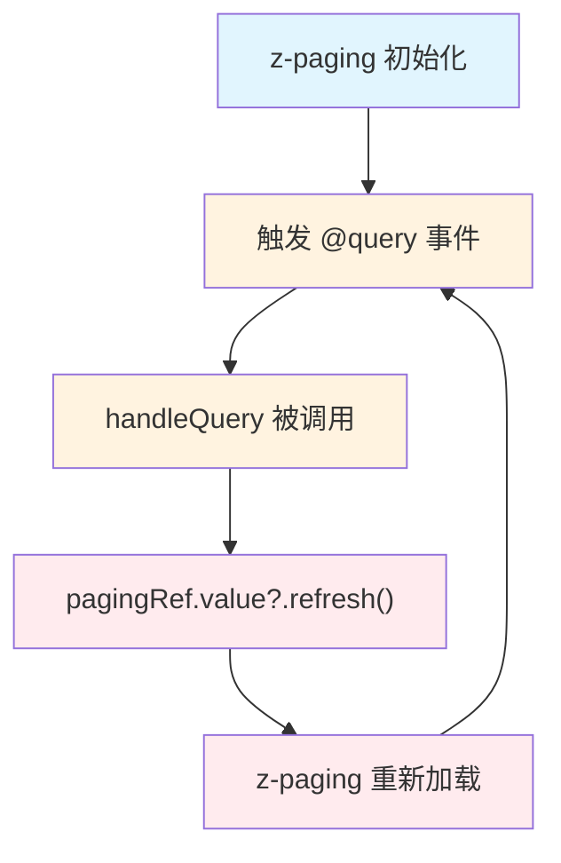

# z-paging 分页组件集成方案

## 1. 适用场景

当页面需要使用 `<z-paging>` 组件实现分页列表功能，同时需要遵循 `api-migration` 规范使用 `useRequest` 管理接口请求时，必须使用本 Skill 中的集成方案。

## 2. 核心约束

### 2.1 api-migration 规范要求

1. **必须使用 useRequest**：所有接口调用都必须通过 Alova 的 `useRequest` 管理状态
2. **必须设置 immediate: false**：禁止自动执行请求，必须手动触发
3. **必须使用回调钩子**：使用 `onSuccess`、`onError`、`onComplete` 处理请求结果
4. **禁止使用 try/catch**：不允许使用 try/catch 包装 send 函数调用

### 2.2 z-paging 核心机制

|     方法     |        用途        |                       调用时机                        |
| :----------: | :----------------: | :---------------------------------------------------: |
|   `@query`   | 接收分页参数并请求 | z-paging 自动调用（组件挂载时、下拉刷新、上拉加载时） |
| `complete()` |  通知数据加载完成  |                 请求成功或失败后调用                  |
|  `reload()`  |    重新加载数据    |      筛选条件变化、手动刷新时调用，重置到第 1 页      |

## 3. 标准集成方案

### 3.1 核心代码模板

```vue
<template>
	<z-paging ref="pagingRef" v-model="dataList" :default-page-size="15" @query="handleQuery">
		<view v-for="item in dataList" :key="item.id">
			{{ item.name }}
		</view>

		<template #empty>
			<wd-status-tip image="search" tip="暂无数据" />
		</template>
	</z-paging>
</template>

<script setup lang="ts">
import type { YourDataType, YourListParams } from "@/types/your-module";
import { useRequest } from "alova/client";
import { ref } from "vue";
import { getYourDataList } from "@/api/your-module";

/** z-paging 组件引用 */
const pagingRef = ref();

/** 列表数据 */
const dataList = ref<YourDataType[]>([]);

/**
 * 使用 useRequest 管理请求状态
 * @description 必须设置 immediate: false，由 z-paging 控制请求时机
 */
const {
	loading,
	send: loadList,
	onSuccess,
	onError,
} = useRequest((params: YourListParams) => getYourDataList(params), { immediate: false });

/**
 * 成功回调 - 通知 z-paging 数据加载完成
 * @description 在回调中调用 complete 方法
 */
onSuccess((event) => {
	const result = event.data;
	// 方式一：传入列表，z-paging 自动判断是否有更多
	pagingRef.value?.complete(result.list || []);

	// 方式二：精确控制（如果后端返回 total）
	// pagingRef.value?.completeByTotal(result.list || [], result.total)
});

/**
 * 失败回调 - 通知 z-paging 加载失败
 * @description 错误提示已由全局拦截器自动处理
 */
onError((error) => {
	console.error("加载列表失败:", error);
	pagingRef.value?.complete(false);
});

/**
 * z-paging 的 @query 回调
 * @description 接收分页参数，触发请求（不使用 await/try-catch）
 */
function handleQuery(pageNo: number, pageSize: number) {
	loadList({
		page: pageNo,
		row: pageSize,
		// 其他筛选参数...
	});
}

/** 手动刷新列表 */
function handleRefresh() {
	pagingRef.value?.reload();
}
</script>
```

### 3.2 带筛选条件的完整示例

```vue
<template>
	<view class="page-container">
		<!-- 搜索栏 -->
		<view class="search-bar">
			<wd-search v-model="searchKeyword" placeholder="搜索..." @search="handleSearch" />
			<wd-button type="primary" size="small" @click="handleSearch"> 搜索 </wd-button>
		</view>

		<!-- 列表 -->
		<z-paging ref="pagingRef" v-model="dataList" :default-page-size="15" @query="handleQuery">
			<view v-for="item in dataList" :key="item.id" class="list-item">
				{{ item.title }}
			</view>

			<template #empty>
				<wd-status-tip image="search" tip="暂无数据" />
			</template>
		</z-paging>
	</view>
</template>

<script setup lang="ts">
import type { RepairOrder, RepairListParams } from "@/types/repair";
import { useRequest } from "alova/client";
import { ref } from "vue";
import { getRepairOrderList } from "@/api/repair";

/** z-paging 组件引用 */
const pagingRef = ref();

/** 列表数据 */
const dataList = ref<RepairOrder[]>([]);

/** 搜索条件 */
const searchKeyword = ref("");
const selectedStatus = ref("");

/**
 * 使用 useRequest 管理请求状态
 */
const {
	loading,
	send: loadList,
	onSuccess,
	onError,
} = useRequest((params: RepairListParams) => getRepairOrderList(params), { immediate: false });

/** 成功回调 */
onSuccess((event) => {
	const result = event.data;
	pagingRef.value?.complete(result.ownerRepairs || []);
});

/** 失败回调 */
onError((error) => {
	console.error("加载列表失败:", error);
	pagingRef.value?.complete(false);
});

/**
 * z-paging 的 @query 回调
 * @description 将筛选条件合并到请求参数中
 */
function handleQuery(pageNo: number, pageSize: number) {
	loadList({
		page: pageNo,
		row: pageSize,
		repairName: searchKeyword.value || undefined,
		state: selectedStatus.value || undefined,
	});
}

/**
 * 搜索处理
 * @description 重置到第一页并刷新
 */
function handleSearch() {
	pagingRef.value?.reload();
}

/**
 * 筛选条件变化
 */
function handleFilterChange() {
	pagingRef.value?.reload();
}
</script>
```

## 4. 关键适配点

### 4.1 不使用 await/try-catch

```typescript
// 错误：使用 try-catch（违反 api-migration 规范）
async function handleQuery(pageNo: number, pageSize: number) {
	try {
		const result = await loadList({ page: pageNo, row: pageSize });
		pagingRef.value?.complete(result.list);
	} catch {
		pagingRef.value?.complete(false);
	}
}

// 正确：使用回调钩子
function handleQuery(pageNo: number, pageSize: number) {
	loadList({ page: pageNo, row: pageSize });
	// complete 在 onSuccess/onError 回调中调用
}
```

### 4.2 在回调中调用 complete

```typescript
// onSuccess 中处理成功
onSuccess((event) => {
	pagingRef.value?.complete(event.data.list || []);
});

// onError 中处理失败
onError((error) => {
	console.error("加载失败:", error);
	pagingRef.value?.complete(false);
});
```

### 4.3 确保 pagingRef 可用性

由于回调是异步执行的，需要使用可选链确保安全调用：

```typescript
onSuccess((event) => {
	// 使用可选链确保安全调用
	pagingRef.value?.complete(event.data.list || []);
});
```

## 5. complete 方法详解

|             调用方式             |                          说明                           |
| :------------------------------: | :-----------------------------------------------------: |
|         `complete(list)`         | 传入数组，z-paging 根据数组长度自动判断是否还有更多数据 |
|        `complete(false)`         |                     加载失败时调用                      |
|  `completeByTotal(list, total)`  |           传入数组和总数，更精确控制分页状态            |
| `completeByNoMore(list, noMore)` |             传入数组和是否没有更多的布尔值              |

## 6. 常见错误模式

|                  错误模式                   |                  原因                  |              正确做法               |
| :-----------------------------------------: | :------------------------------------: | :---------------------------------: |
|         在 @query 中使用 try/catch          | 违反 api-migration 禁止 try/catch 规范 |     使用 onSuccess/onError 回调     |
|      在 @query 中直接调用 uni.request       |       未使用 useRequest 管理状态       |    使用 useRequest 的 send 方法     |
|            手动管理 loading 状态            |         useRequest 已自动管理          | 直接使用 useRequest 的 loading 状态 |
|        在 onError 中重复显示错误提示        |          全局拦截器已自动处理          |  仅记录日志和调用 complete(false)   |
|   同时使用 `:query` 属性和 `@query` 事件    |            两种绑定方式冲突            |         只选择其中一种方式          |
| 在 @query 回调中调用 `refresh()`/`reload()` |              触发无限循环              |  仅调用 `complete()` 通知加载结果   |
|     使用 @query 时设置 `:auto="false"`      |          阻止自动触发首次加载          |        移除 `:auto="false"`         |
|        `complete()` 传入对象而非数组        |              参数类型错误              |         传入数组或 `false`          |

## 6.5 危险模式与陷阱

> **警告**：以下模式会导致页面卡死或严重性能问题，务必避免。

### 6.5.1 属性与事件混用禁忌

z-paging 提供两种查询绑定方式，**必须二选一**，不可混用：

|     用法      |                     正确方式                      |                 错误方式                 |
| :-----------: | :-----------------------------------------------: | :--------------------------------------: |
| `:query` 属性 |     传入查询函数，z-paging 内部调用并管理状态     | 与 `@query` 事件混用，导致重复触发或冲突 |
| `@query` 事件 | 监听查询事件，在回调中执行请求并调用 `complete()` | 在回调中调用 `refresh()`/`reload()` 方法 |

```vue
<!-- 错误：属性和事件混用 -->
<z-paging :query="queryList" @query="handleRefresh"></z-paging>
```

### 6.5.2 无限循环陷阱

在 `@query` 回调中调用 `refresh()` 或 `reload()` 会导致**无限循环**，页面完全卡死：



**错误代码示例**：

```typescript
// 错误：在 @query 回调中调用 refresh，导致无限循环！
function handleQuery(pageNo: number, pageSize: number) {
	currentPage.value = 1;
	pagingRef.value?.refresh(); // ❌ 这会再次触发 @query，形成死循环
}

// 正确：@query 回调只负责发起请求
function handleQuery(pageNo: number, pageSize: number) {
	loadList({
		page: pageNo,
		row: pageSize,
	});
	// complete() 在 onSuccess/onError 回调中调用
}
```

### 6.5.3 `:auto="false"` 配合规则

使用 `@query` 事件时，**不要**设置 `:auto="false"`，否则 z-paging 不会自动触发首次加载：

```vue
<!-- 错误：@query + :auto="false" 会阻止首次加载 -->
<z-paging :auto="false" @query="handleQuery"></z-paging>
```

## 7. immediate: false 必要性

由于 z-paging 会在组件挂载时自动触发 `@query` 事件，因此 `useRequest` 必须设置 `immediate: false`，避免重复请求：

```typescript
const { send: loadList } = useRequest(
	(params) => getDataList(params),
	{ immediate: false }, // 必须设置，由 z-paging 控制请求时机
);
```

## 8. z-paging 的 auto 属性

如果设置 `:auto="false"`，z-paging 不会在挂载时自动触发 `@query`，需要手动调用 `reload()`：

```typescript
onMounted(() => {
	// 手动触发首次加载
	setTimeout(() => {
		pagingRef.value?.reload();
	}, 100);
});
```

## 9. 适配核心原则总结

1. **使用 useRequest 管理请求**：符合 api-migration 规范
2. **在回调钩子中调用 complete**：将 z-paging 的完成通知放在 onSuccess/onError 中
3. **不使用 try/catch**：遵循回调钩子模式
4. **保持职责分离**：错误提示由全局拦截器处理，组件层仅负责日志和 UI 状态

## 10. 代码审查检查点

在代码审查时，针对 z-paging 组件应检查以下事项：

- [ ] 是否同时使用了 `:query` 属性和 `@query` 事件？（禁止混用）
- [ ] `@query` 回调中是否调用了 `refresh()` 或 `reload()`？（会导致无限循环）
- [ ] `complete()` 方法的参数类型是否正确？（应为数组或 `false`）
- [ ] 是否有不必要的 `:auto="false"` 配置？（使用 `@query` 时应移除）
- [ ] `useRequest` 是否设置了 `immediate: false`？（必须设置）
- [ ] 是否使用了 try/catch 包装请求？（违反 api-migration 规范）

## 11. 相关事故案例

### 2025-12-05 页面卡死事故

**事故文件**：`docs/reports/2025-12-05-z-paging-infinite-loop-bug-report.md`

**影响范围**：选择器模块三个页面（楼栋/单元/房屋选择）完全卡死

**根本原因**：

1. 同时使用 `:query` 属性和 `@query` 事件
2. 在 `@query` 回调中调用 `refresh()` 导致无限循环
3. 使用 `@query` 时设置了 `:auto="false"`

## 12. 实战复用方法论（进页即自动加载）

### 12.1 核心步骤

1. **ref + reload 首屏加载**：定义 `pagingRef = ref()`，在 `onMounted(() => pagingRef.value?.reload())` 触发首屏请求。
2. **useRequest 回调收口**：`immediate: false`，`onSuccess` 里调用 `pagingRef.value?.complete(list, total)`，`onError` 调用 `complete(false)`；不在 `@query` 中写 `await/try/catch`。
3. **@query 只发请求**：`handleQuery(pageNo, pageSize)` 仅调用 `send({ page: pageNo, row: pageSize, ...filters })`，不触发 `reload/refresh`。
4. **常用 props**：`:refresher-enabled="true"`, `:loading-more-enabled="true"`, `:show-scrollbar="false"`, `:default-page-size="xx"`，根据需要补 `:fixed`、安全区配置。
5. **插槽补全**：提供 `#empty`、`#loading`，避免白屏无反馈。

### 12.2 快速模板

```ts
const pagingRef = ref();
const dataList = ref<Item[]>([]);

const { send: loadList } = useRequest((params) => api(params), { immediate: false })
	.onSuccess((event) => {
		const res = event.data;
		pagingRef.value?.complete(res.list || [], res.total || 0);
	})
	.onError(() => {
		pagingRef.value?.complete(false);
	});

function handleQuery(pageNo: number, pageSize: number) {
	loadList({ page: pageNo, row: pageSize, ...filters });
}

onMounted(() => {
	pagingRef.value?.reload();
});
```

### 12.3 必查清单

- [ ] `immediate: false` 已设置
- [ ] `onSuccess/onError` 调用 `complete/complete(false)` 或 `completeByTotal`
- [ ] `@query` 未使用 `await/try/catch`，未调用 `reload/refresh`
- [ ] `onMounted` 首屏 `reload()`
- [ ] `refresher-enabled/loading-more-enabled/show-scrollbar` 等常用 props 已配置
