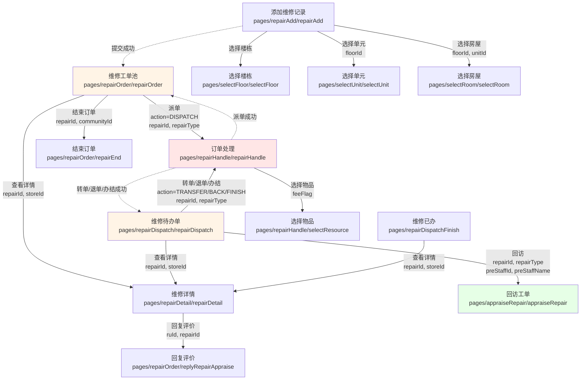
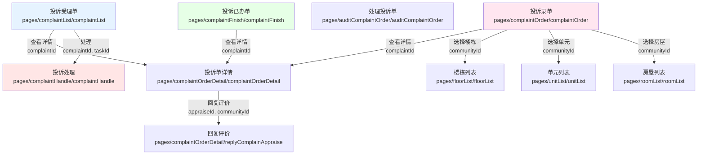
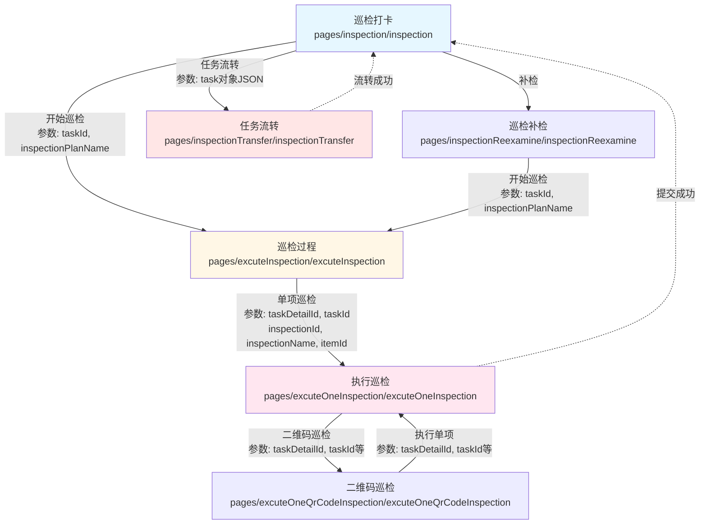
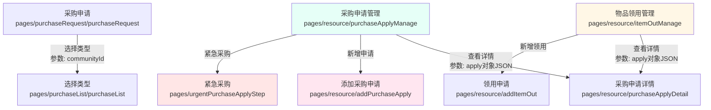
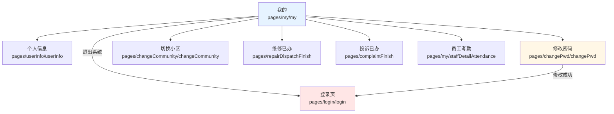
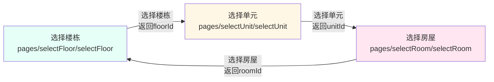
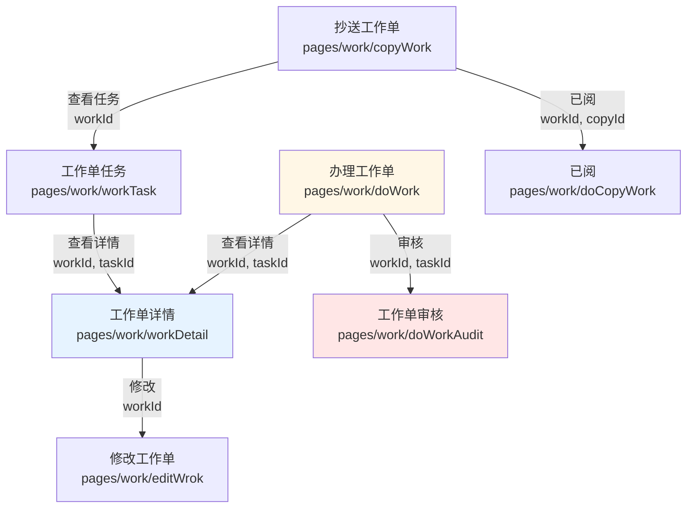

# Vue2 旧项目路由跳转关系脑图

本文档展示了 `gitee-example` 目录下 Vue2 uni-app 项目的路由跳转关系。

## 说明

- 只展示 `uni.navigateTo()`, `uni.redirectTo()`, `uni.reLaunch()` 三种 forward 跳转
- 忽略返回操作 (`navigateBack`) 和 Tab 切换 (`switchTab`)
- 标注了关键的跳转参数

---

## 1. 总览图：以首页/工作台为中心的导航结构

```mermaid
graph TB
    %% 入口页面
    Index["首页<br/>pages/index/index"]
    Work["工作台<br/>pages/index/work"]
    My["我的<br/>pages/my/my"]

    %% 主要功能模块入口
    RepairOrder["维修工单池<br/>pages/repairOrder/repairOrder"]
    RepairDispatch["维修待办单<br/>pages/repairDispatch/repairDispatch"]
    ComplaintList["投诉受理单<br/>pages/complaintList/complaintList"]
    Inspection["巡检打卡<br/>pages/inspection/inspection"]
    PurchaseManage["采购申请管理<br/>pages/resource/purchaseApplyManage"]
    ItemOutManage["物品领用管理<br/>pages/resource/itemOutManage"]

    %% 个人中心功能
    UserInfo["个人信息<br/>pages/userInfo/userInfo"]
    ChangePwd["修改密码<br/>pages/changePwd/changePwd"]
    ChangeCommunity["切换小区<br/>pages/changeCommunity/changeCommunity"]
    RepairFinish["维修已办<br/>pages/repairDispatchFinish"]
    ComplaintFinish["投诉已办<br/>pages/complaintFinish"]
    StaffAttendance["员工考勤<br/>pages/my/staffDetailAttendance"]
    Login["登录页<br/>pages/login/login"]

    %% 连接关系 - 从我的页面出发
    My --> ChangeCommunity
    My --> UserInfo
    My --> RepairFinish
    My --> ComplaintFinish
    My --> StaffAttendance
    My --> ChangePwd
    My -->|退出系统| Login
    ChangePwd -->|修改成功| Login

    %% 标注：工作台和首页是主要入口，通过TabBar访问各功能模块
    style Index fill:#e1f5ff
    style Work fill:#e1f5ff
    style My fill:#e1f5ff
    style Login fill:#ffe1e1
```

---

## 2. 维修工单流程模块

---

## 3. 投诉处理流程模块

---

## 4. 巡检管理流程模块

---

## 5. 采购/资源管理流程模块

---

## 6. 个人中心模块

---

## 7. 其他辅助功能模块

### 7.1 房屋选择流程

### 7.2 工作单流程

---

## 关键跳转模式总结

|  跳转类型  |    使用场景    | 示例              |
| :--------: | :------------: | :---------------- |
| navigateTo |  普通页面跳转  | 列表 → 详情       |
| redirectTo | 表单提交后跳转 | 提交成功 → 列表页 |
|  reLaunch  |    应用重启    | 登录成功 → 首页   |

## 参数传递方式

|      方式      | 说明     | 示例                              |
| :------------: | :------- | :-------------------------------- |
| URL 查询字符串 | 简单参数 | `?repairId=xxx&storeId=xxx`       |
|  JSON 序列化   | 复杂对象 | `?apply=` + `JSON.stringify(obj)` |
|    本地存储    | 大量数据 | `uni.setStorageSync()`            |

---

**生成时间**: 2025-10-20
**项目**: HC 掌上物业 Vue2 版本 (gitee-example)
