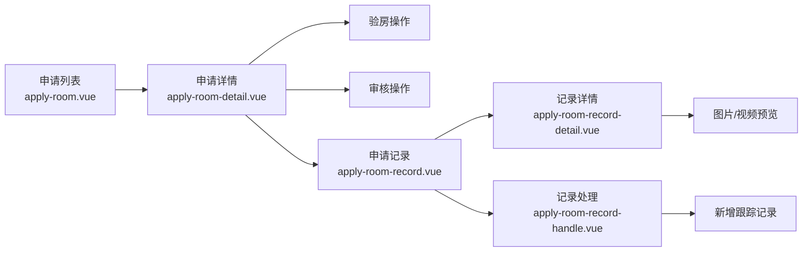

# applyRoom 系列页面系统性迁移完成报告

## ✅ 迁移完成清单

### 🎯 已完成迁移的页面 (5 个)

| 序号 | 原始路径                                                              | 新路径 (严格遵循路由映射表)                           | 页面功能             | 迁移状态 |
| :--- | :-------------------------------------------------------------------- | :---------------------------------------------------- | :------------------- | :------- |
| 1    | `gitee-example/pages/applyRoom/applyRoom.vue`                         | `src/pages-sub/property/apply-room.vue`               | 房屋申请列表页面     | ✅ 完成  |
| 2    | `gitee-example/pages/applyRoomDetail/applyRoomDetail.vue`             | `src/pages-sub/property/apply-room-detail.vue`        | 房屋申请详情页面     | ✅ 完成  |
| 3    | `gitee-example/pages/applyRoomRecord/applyRoomRecord.vue`             | `src/pages-sub/property/apply-room-record.vue`        | 房屋申请记录页面     | ✅ 完成  |
| 4    | `gitee-example/pages/applyRoomRecordDetail/applyRoomRecordDetail.vue` | `src/pages-sub/property/apply-room-record-detail.vue` | 房屋申请记录详情页面 | ✅ 完成  |
| 5    | `gitee-example/pages/applyRoomRecordHandle/applyRoomRecordHandle.vue` | `src/pages-sub/property/apply-room-record-handle.vue` | 房屋申请记录处理页面 | ✅ 完成  |

## 🔄 技术栈迁移对比

## 📊 迁移统计数据

### 📋 房屋申请管理

- ✅ 空置房申请列表展示
- ✅ 申请状态筛选和搜索
- ✅ 申请详情查看
- ✅ 验房操作（通过/不通过）
- ✅ 审核操作（通过/不通过）
- ✅ 折扣费用处理

### 📝 跟踪记录管理

- ✅ 跟踪记录列表查询
- ✅ 记录详情查看（图片/视频）
- ✅ 新增跟踪记录
- ✅ 图片上传和管理
- ✅ 记录删除操作

### 💰 费用管理

- ✅ 费用详情查询
- ✅ 费用折扣管理
- ✅ 缴费历史查看
- ✅ 费用计算和统计

## 🎨 UnoCSS 配置优化

## 🔗 页面间跳转关系

