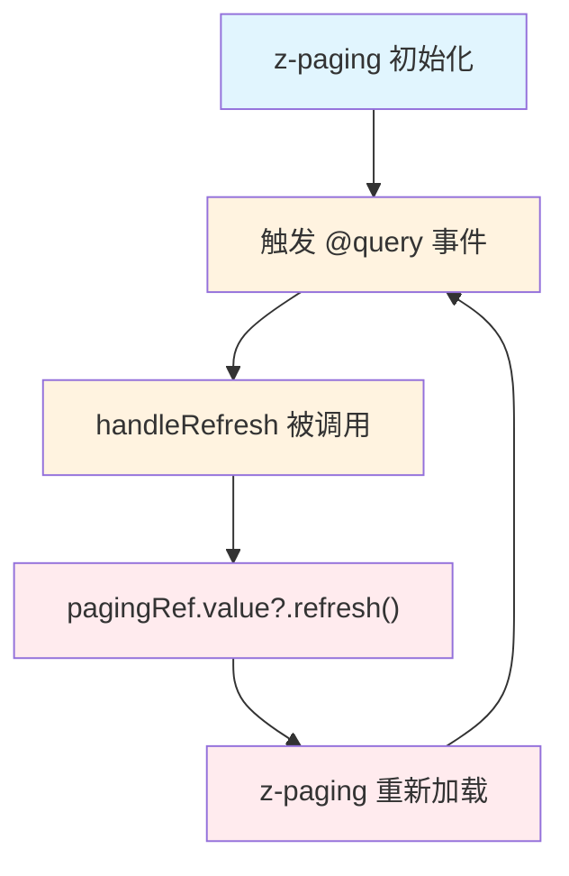

# z-paging 组件使用不当导致页面卡死事故报告

## 1. 事故概述

|   项目   |                   内容                   |
| :------: | :--------------------------------------: |
| 事故时间 |                2025-12-05                |
| 影响范围 | 选择器模块三个页面（楼栋/单元/房屋选择） |
| 严重程度 |            高（页面完全卡死）            |
| 根本原因 | z-paging 组件属性与事件混用导致无限循环  |
| 修复状态 |                  已修复                  |

## 2. 问题现象

进入以下页面时，页面完全卡死，无法操作，且没有任何接口请求发出：

- `select-floor.vue` - 选择楼栋页面
- `select-unit.vue` - 选择单元页面
- `select-room.vue` - 选择房屋页面

## 3. 根本原因分析

### 3.1 错误代码示例

```vue
<template>
  <z-paging
    ref="pagingRef"
    v-model="floorList"
    :query="queryList"      <!-- ❌ 属性绑定 -->
    :auto="false"           <!-- ❌ 禁用自动加载 -->
    @query="handleRefresh"  <!-- ❌ 事件监听（导致无限循环！） -->
  >
    <!-- 内容 -->
  </z-paging>
</template>
```

### 3.2 无限循环触发机制

问题出在 `@query="handleRefresh"` 这一行。`handleRefresh` 函数的实现如下：

```typescript
function handleRefresh() {
	currentPage.value = 1;
	pagingRef.value?.refresh(); // ❌ 这里触发了 z-paging 重新加载
}
```

**无限循环流程：**



> ⚠️ **无限循环！** `refresh()` 触发重新加载 → 再次触发 `@query` 事件 → 永无止境

### 3.3 混淆了属性与事件的用法

|     用法      |                     正确方式                      |                   错误方式                    |
| :-----------: | :-----------------------------------------------: | :-------------------------------------------: |
| `:query` 属性 |     传入查询函数，z-paging 内部调用并管理状态     |   与 `@query` 事件混用，导致重复触发或冲突    |
| `@query` 事件 | 监听查询事件，在回调中执行请求并调用 `complete()` |   在回调中调用 `refresh()`/`reload()` 方法    |
| `:auto` 属性  |  设为 `false` 时需要手动调用 `reload()` 触发加载  | 与 `@query` 事件配合时设为 `false` 会阻止加载 |

## 4. 修复方案

### 4.1 正确的 z-paging 使用方式

```vue
<template>
  <z-paging
    ref="pagingRef"
    v-model="floorList"
    :default-page-size="50"
    :refresher-enabled="true"
    :loading-more-enabled="true"
    @query="handleQuery"    <!-- ✅ 只使用事件监听方式 -->
  >
    <!-- 内容 -->
  </z-paging>
</template>
```

### 4.2 正确的查询回调实现

```typescript
/** z-paging 查询回调 */
async function handleQuery(pageNo: number, pageSizeValue: number) {
	currentPage.value = pageNo;
	pageSize.value = pageSizeValue;

	try {
		const response = await loadFloorData();

		if (response) {
			// ✅ z-paging complete 接收数组
			pagingRef.value?.complete(response.list || []);
		} else {
			pagingRef.value?.complete([]);
		}
	} catch (error) {
		console.error("获取楼栋列表失败:", error);
		// ✅ 通知 z-paging 加载失败
		pagingRef.value?.complete(false);

		uni.showToast({
			title: "加载楼栋列表失败",
			icon: "none",
		});
	}
}
```

### 4.3 关键修改点对照表

|      修改项       |              修改前               |         修改后         |
| :---------------: | :-------------------------------: | :--------------------: |
|   查询绑定方式    |       `:query="queryList"`        | `@query="handleQuery"` |
|     auto 属性     |          `:auto="false"`          |   移除（默认 true）    |
|    query 事件     |     `@query="handleRefresh"`      | `@query="handleQuery"` |
|   complete 参数   |     `{ list: [], total: 0 }`      |      `[]`（数组）      |
|   手动触发加载    | `setTimeout(() => reload(), 100)` |          移除          |
| onSuccess/onError |          分离的回调函数           | 合并到 handleQuery 中  |

## 5. 受影响文件清单

|                 文件路径                  |   修改类型   |
| :---------------------------------------: | :----------: |
| `src/pages-sub/selector/select-floor.vue` | 核心逻辑修复 |
| `src/pages-sub/selector/select-unit.vue`  | 核心逻辑修复 |
| `src/pages-sub/selector/select-room.vue`  | 核心逻辑修复 |

## 6. 经验总结

### 6.1 z-paging 组件使用规范

1. **选择一种绑定方式**：要么使用 `:query` 属性方式，要么使用 `@query` 事件方式，不要混用
2. **推荐使用事件方式**：`@query` 事件方式更灵活，可以直接在回调中处理成功/失败逻辑
3. **不要在 query 回调中调用 refresh/reload**：这会导致无限循环
4. **complete() 方法参数**：
   - 成功时传入**数组**：`complete(list)`
   - 失败时传入 `false`：`complete(false)`
5. **移除 `:auto="false"`**：使用 `@query` 事件时，让 z-paging 自动触发首次加载

### 6.2 代码审查检查点

在代码审查时，针对 z-paging 组件应检查：

- [ ] 是否同时使用了 `:query` 属性和 `@query` 事件？
- [ ] `@query` 回调中是否调用了 `refresh()` 或 `reload()`？
- [ ] `complete()` 方法的参数类型是否正确？
- [ ] 是否有不必要的 `:auto="false"` 配置？

## 7. 参考资料

- [z-paging 官方文档](https://z-paging.zxlee.cn/)
- 项目内正确实现参考：`src/pages-sub/repair/order-list.vue`
