# Vue2 旧项目路由跳转关系脑图（完整版）

本文档展示了 `gitee-example` 目录下 Vue2 uni-app 项目的**完整**路由跳转关系。

## 说明

- 只展示 `uni.navigateTo()`, `uni.redirectTo()`, `uni.reLaunch()` 三种 forward 跳转
- 忽略返回操作 (`navigateBack`) 和 Tab 切换 (`switchTab`)
- 标注了关键的跳转参数
- **本版本已覆盖所有主要业务模块（18 个模块，180+ 页面）**

## 目录

- [Vue2 旧项目路由跳转关系脑图（完整版）](#vue2-旧项目路由跳转关系脑图完整版)
  - [说明](#说明)
  - [目录](#目录)
  - [1. 总览图：以首页/工作台为中心的导航结构](#1-总览图以首页工作台为中心的导航结构)
  - [2. 维修工单流程模块](#2-维修工单流程模块)
  - [3. 投诉处理流程模块](#3-投诉处理流程模块)
  - [4. 巡检管理流程模块](#4-巡检管理流程模块)
  - [5. 空置房管理流程模块](#5-空置房管理流程模块)
  - [6. 装修管理流程模块](#6-装修管理流程模块)
  - [7. 设备保养流程模块](#7-设备保养流程模块)
  - [8. 采购/资源管理流程模块](#8-采购资源管理流程模块)
  - [9. 费用管理模块](#9-费用管理模块)
  - [10. 抄表管理模块](#10-抄表管理模块)
  - [11. 业主管理模块](#11-业主管理模块)
  - [12. 车辆管理模块](#12-车辆管理模块)
  - [13. OA 工作流模块](#13-oa-工作流模块)
  - [14. 工作单模块](#14-工作单模块)
  - [15. 报表统计模块](#15-报表统计模块)
  - [16. 个人中心模块](#16-个人中心模块)
  - [17. 公告活动模块](#17-公告活动模块)
  - [18. 其他辅助功能](#18-其他辅助功能)
    - [18.1 房屋选择流程](#181-房屋选择流程)
    - [18.2 其他功能页面](#182-其他功能页面)
  - [模块统计总览](#模块统计总览)
  - [关键跳转模式总结](#关键跳转模式总结)
  - [参数传递方式](#参数传递方式)
  - [主要业务流程路径](#主要业务流程路径)
    - [1. 维修工单流程](#1-维修工单流程)
    - [2. 投诉处理流程](#2-投诉处理流程)
    - [3. 巡检流程](#3-巡检流程)
    - [4. 空置房管理流程](#4-空置房管理流程)
    - [5. 装修管理流程](#5-装修管理流程)
    - [6. 采购流程](#6-采购流程)
    - [7. 费用管理流程](#7-费用管理流程)
    - [8. 抄表流程](#8-抄表流程)

## 1. 总览图：以首页/工作台为中心的导航结构

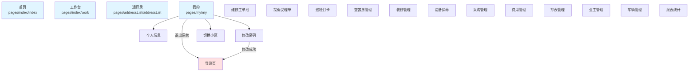

## 2. 维修工单流程模块

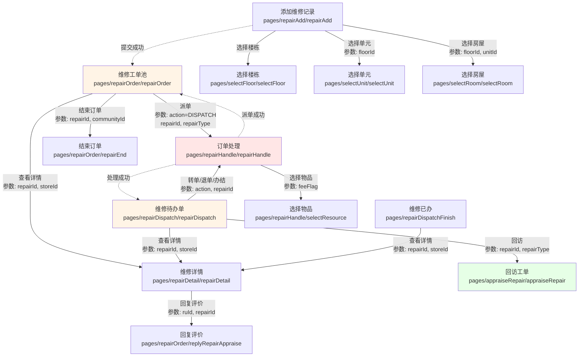

## 3. 投诉处理流程模块

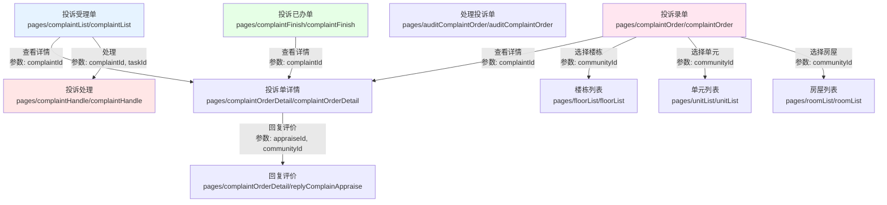

## 4. 巡检管理流程模块

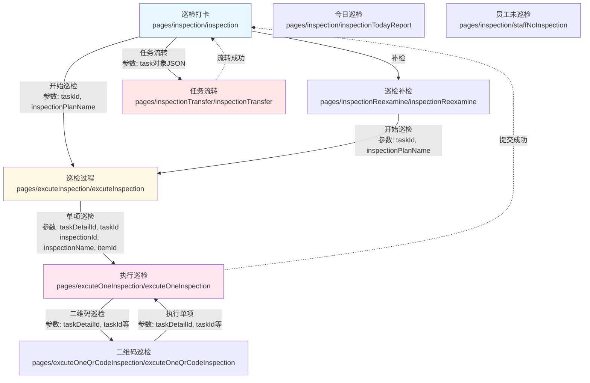

## 5. 空置房管理流程模块

> ⭐ **重要模块**：此模块之前被遗漏，现已补充完整

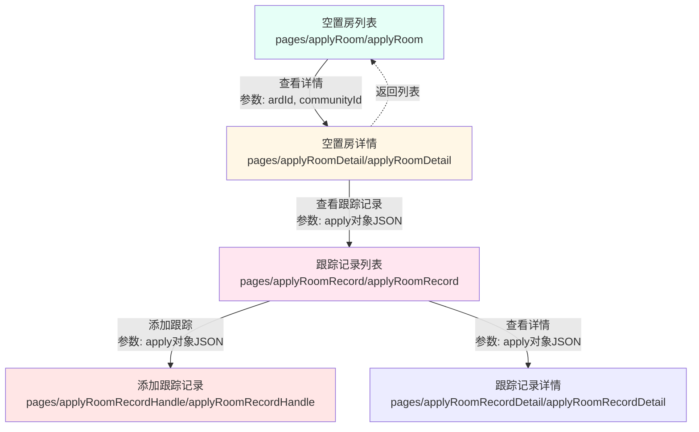

## 6. 装修管理流程模块

> ⭐ **重要模块**：装修申请和跟踪流程

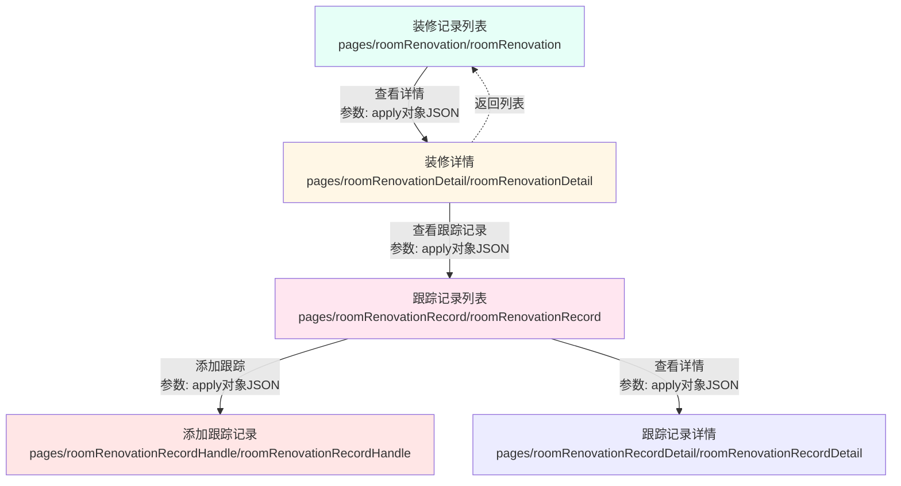

## 7. 设备保养流程模块

> ⭐ **重要模块**：设备定期保养管理

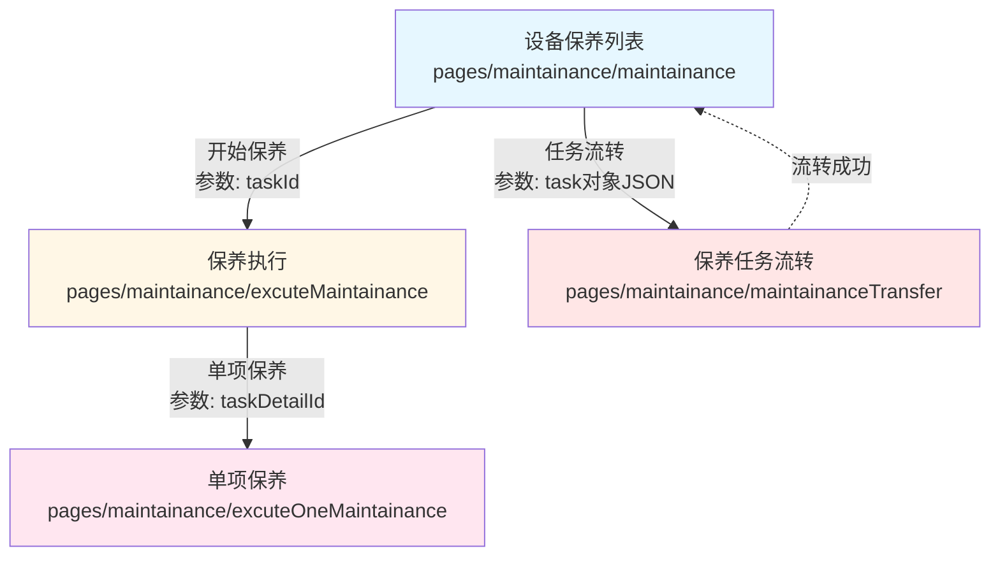

## 8. 采购/资源管理流程模块

```mermaid
graph TB
    %% 采购资源管理主要页面
    PurchaseRequest["采购申请<br/>pages/purchaseRequest/purchaseRequest"]
    PurchaseManage["采购申请管理<br/>pages/resource/purchaseApplyManage"]
    AddPurchase["添加采购申请<br/>pages/resource/addPurchaseApply"]
    EditPurchase["修改采购申请<br/>pages/resource/editPurchaseApply"]
    PurchaseDetail["采购申请详情<br/>pages/resource/purchaseApplyDetail"]
    PurchaseAudit["采购审批<br/>pages/resource/purchaseApplyAuditOrders"]
    UrgentPurchase["紧急采购<br/>pages/urgentPurchaseApplyStep"]

    ItemOutManage["物品领用管理<br/>pages/resource/itemOutManage"]
    AddItemOut["领用申请<br/>pages/resource/addItemOut"]
    ItemOutAudit["领用审批<br/>pages/resource/itemOutAuditOrders"]
    ItemOutDo["物品发放<br/>pages/resource/itemOutDo"]
    ItemEnterDo["物品入库<br/>pages/resource/itemEnterDo"]

    AllocationManage["调拨列表<br/>pages/resource/allocationStorehouseManage"]
    AllocationApply["物品调拨<br/>pages/resource/allocationStorehouseApply"]
    AllocationAudit["调拨审批<br/>pages/resource/allocationStorehouseAuditOrders"]
    AllocationDetail["调拨详情<br/>pages/resource/allocationStorehouseApplyDetail"]
    AllocationEnter["调拨入库<br/>pages/resource/allocationEnterDo"]

    ResourceStore["我的物品<br/>pages/resourceStoreManage/resourceStoreManage"]
    ResourceReturn["物品退还<br/>pages/resourceStoreReturn/resourceStoreReturn"]
    ResourceScrap["物品损耗<br/>pages/resourceStoreScrap/resourceScrap"]
    ResourceTransfer["物品转赠<br/>pages/resourceStoreTransfer/resourceStoreTransfer"]

    PurchaseList["选择类型<br/>pages/purchaseList/purchaseList"]

    %% 采购申请的跳转
    PurchaseRequest -->|选择类型<br/>参数: communityId| PurchaseList

    %% 采购申请管理的跳转
    PurchaseManage -->|查看详情<br/>参数: apply对象JSON| PurchaseDetail
    PurchaseManage -->|新增申请| AddPurchase
    PurchaseManage -->|修改申请<br/>参数: purchaseApplyId| EditPurchase
    PurchaseManage -->|紧急采购| UrgentPurchase

    %% 物品领用管理的跳转
    ItemOutManage -->|查看详情<br/>参数: apply对象JSON| PurchaseDetail
    ItemOutManage -->|新增领用| AddItemOut
    ItemOutManage -->|审批<br/>参数: itemOutId| ItemOutAudit

    %% 调拨管理的跳转
    AllocationManage -->|新增调拨| AllocationApply
    AllocationManage -->|查看详情<br/>参数: applyId| AllocationDetail

    %% 我的物品的跳转
    ResourceStore -->|物品退还| ResourceReturn
    ResourceStore -->|物品损耗| ResourceScrap
    ResourceStore -->|物品转赠| ResourceTransfer

    %% 样式
    style PurchaseManage fill:#e6fff7
    style ItemOutManage fill:#fff7e6
    style AllocationManage fill:#ffe6f0
    style ResourceStore fill:#e6ffe6
```

## 9. 费用管理模块

> ⭐ **重要模块**：费用收取、催缴管理

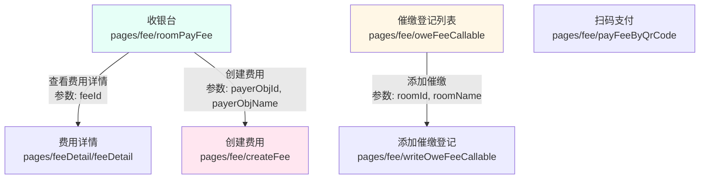

## 10. 抄表管理模块

> ⭐ **重要模块**：水电抄表功能

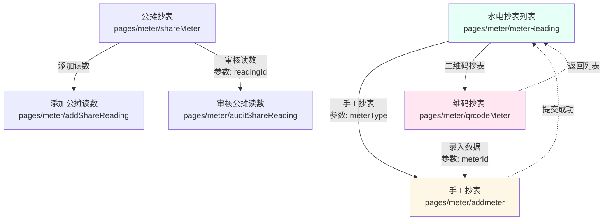

## 11. 业主管理模块

> ⭐ **重要模块**：业主信息管理

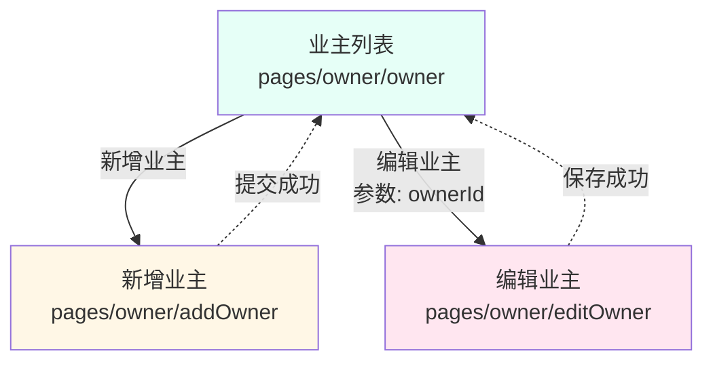

## 12. 车辆管理模块

> ⭐ **重要模块**：停车场、道闸管理

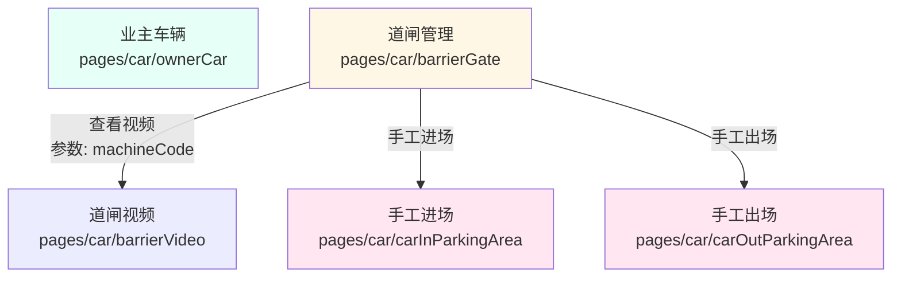

## 13. OA 工作流模块

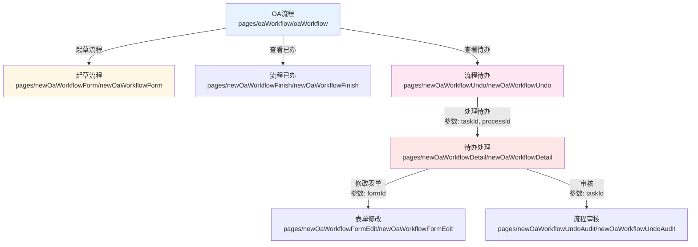

## 14. 工作单模块

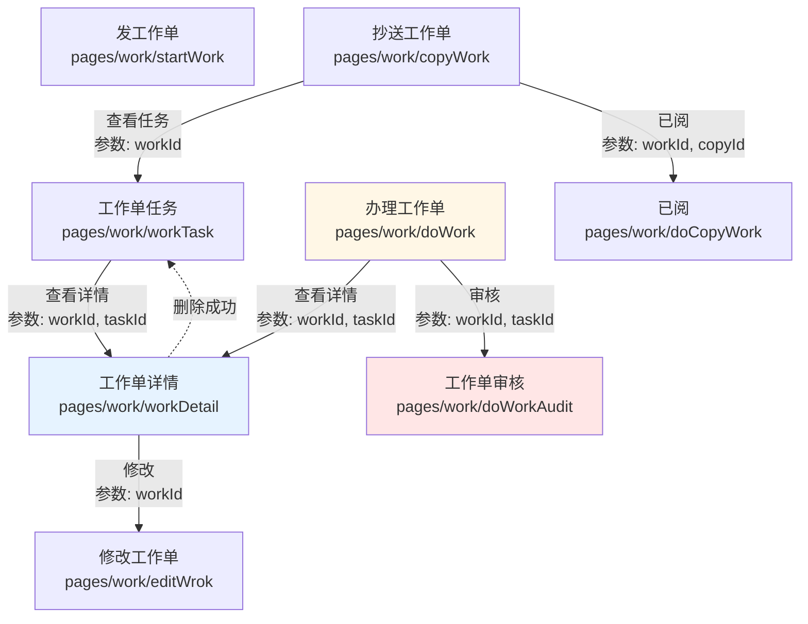

## 15. 报表统计模块

> ⭐ **重要模块**：各类数据报表

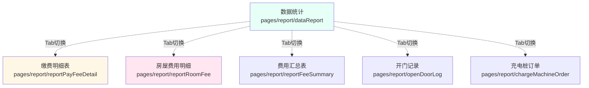

## 16. 个人中心模块

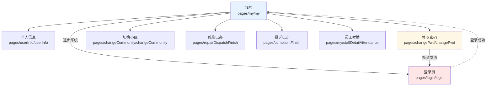

## 17. 公告活动模块

> ⭐ **重要模块**：小区公告和文化活动

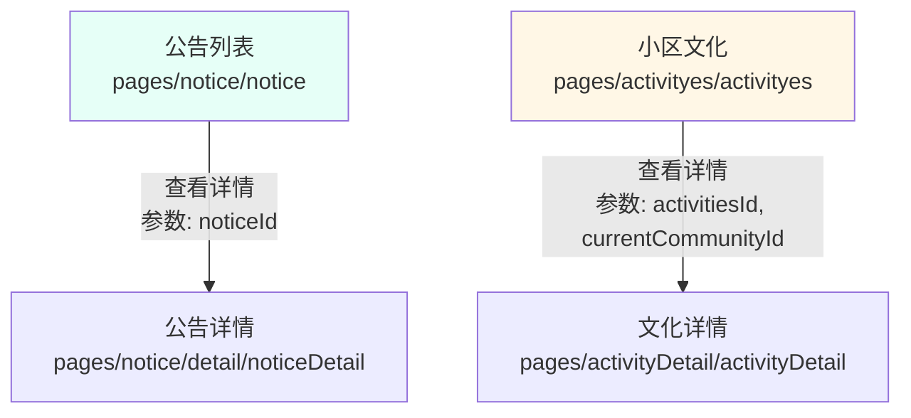

## 18. 其他辅助功能

### 18.1 房屋选择流程

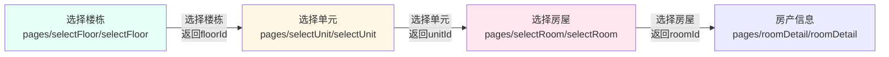

### 18.2 其他功能页面

```mermaid
graph TB
    %% 其他功能页面
    Appointment["预约核销<br/>pages/appointment/appointment"]
    HouOne["核销扫码<br/>pages/appointment/hou_one"]
    WriteOffCoupon["核销优惠券<br/>pages/coupon/writeOffCoupon"]
    WirteOffReserve["核销预约<br/>pages/coupon/wirteOffReserve"]
    ItemRelease["物品发布<br/>pages/itemRelease/itemRelease"]
    ItemReleaseDetail["发布详情<br/>pages/itemRelease/itemReleaseDetail"]
    Visit["访问记录<br/>pages/visit/visit"]
    VisitDetail["访问详情<br/>pages/visit/visitDetail"]
    UndoAudit["待办审核<br/>pages/audit/undoAudit"]
    VideoList["监控列表<br/>pages/video/videoList"]
    PlayVideo["观看视频<br/>pages/video/playVideo"]
    Charge["充电桩<br/>pages/charge/charge"]
    ChargeDetail["充电桩详情<br/>pages/charge/chargeDetail"]
    HcWebView["WebView<br/>pages/hcWebView/hcWebView"]

    %% 预约核销的跳转
    Appointment -->|核销扫码| HouOne

    %% 物品发布的跳转
    ItemRelease -->|查看详情<br/>参数: itemId| ItemReleaseDetail

    %% 访问记录的跳转
    Visit -->|查看详情<br/>参数: visitId| VisitDetail

    %% 监控的跳转
    VideoList -->|观看视频<br/>参数: videoUrl| PlayVideo

    %% 充电桩的跳转
    Charge -->|查看详情<br/>参数: chargeId| ChargeDetail

    %% 样式
    style Appointment fill:#e6fff7
    style VideoList fill:#fff7e6
    style Charge fill:#ffe6f0
```

## 模块统计总览

| 序号 | 模块名称       |  页面数  | 主要功能                     |
| :--: | :------------- | :------: | :--------------------------- |
|  1   | 基础模块       |    5     | 首页、工作台、通讯录、我的   |
|  2   | 维修工单流程   |   10+    | 工单派遣、处理、回访         |
|  3   | 投诉处理流程   |    7     | 投诉受理、处理、评价         |
|  4   | 巡检管理流程   |    8     | 巡检打卡、执行、补检         |
|  5   | 空置房管理流程 |    5     | 空置房申请、跟踪             |
|  6   | 装修管理流程   |    5     | 装修申请、跟踪               |
|  7   | 设备保养流程   |    4     | 设备保养任务管理             |
|  8   | 采购/资源管理  |   20+    | 采购、领用、调拨、入库       |
|  9   | 费用管理       |    6     | 收费、催缴                   |
|  10  | 抄表管理       |    6     | 水电抄表、公摊抄表           |
|  11  | 业主管理       |    3     | 业主信息维护                 |
|  12  | 车辆管理       |    5     | 车辆、道闸、进出场           |
|  13  | OA 工作流      |    7     | 流程审批                     |
|  14  | 工作单         |    8     | 工作任务管理                 |
|  15  | 报表统计       |    6     | 各类数据报表                 |
|  16  | 个人中心       |    7     | 个人信息、设置               |
|  17  | 公告活动       |    4     | 公告、小区文化活动           |
|  18  | 其他辅助功能   |   20+    | 房屋选择、预约、监控、充电桩 |
|      | **合计**       | **130+** | **18 个主要业务模块**        |

## 关键跳转模式总结

|  跳转类型  |    使用场景    | 示例              |
| :--------: | :------------: | :---------------- |
| navigateTo |  普通页面跳转  | 列表 → 详情       |
| redirectTo | 表单提交后跳转 | 提交成功 → 列表页 |
|  reLaunch  |    应用重启    | 登录成功 → 首页   |

## 参数传递方式

|      方式      | 说明     | 示例                              |
| :------------: | :------- | :-------------------------------- |
| URL 查询字符串 | 简单参数 | `?repairId=xxx&storeId=xxx`       |
|  JSON 序列化   | 复杂对象 | `?apply=` + `JSON.stringify(obj)` |
|    本地存储    | 大量数据 | `uni.setStorageSync()`            |

## 主要业务流程路径

### 1. 维修工单流程

```plain
工单池 → 工单详情 → 工单处理 → 选择物品 → 派单成功 → 工单已办
```

### 2. 投诉处理流程

```plain
投诉列表 → 投诉详情 → 投诉处理 → 投诉已办
```

### 3. 巡检流程

```plain
巡检列表 → 巡检过程 → 执行单项巡检 → 二维码巡检 → 提交完成
```

### 4. 空置房管理流程

```plain
空置房列表 → 空置房详情 → 跟踪记录列表 → 添加/查看跟踪记录
```

### 5. 装修管理流程

```plain
装修记录列表 → 装修详情 → 跟踪记录列表 → 添加/查看跟踪记录
```

### 6. 采购流程

```plain
采购管理 → 添加/编辑采购申请 → 采购详情 → 采购审批
```

### 7. 费用管理流程

```plain
收银台 → 费用详情 / 创建费用 / 催缴登记
```

### 8. 抄表流程

```plain
抄表列表 → 手工抄表 / 二维码抄表 → 提交成功
```

**生成时间**: 2025-10-20
**项目**: HC 掌上物业 Vue2 版本 (gitee-example)
**覆盖范围**: 18 个业务模块，130+ 页面
**版本**: v2.0 完整版
